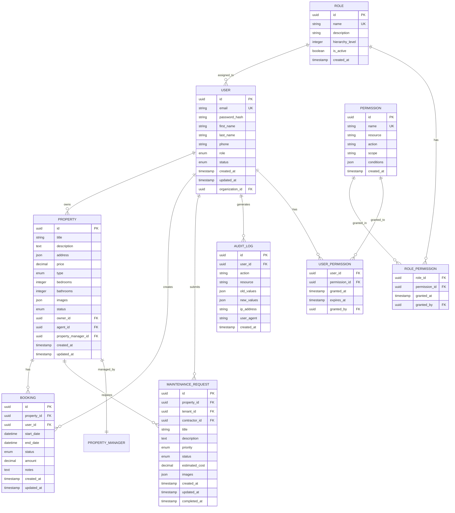

# PropertyMasters UK - Technical Architecture Document

## 1. Architecture Design


## 2. Technology Description

- **Frontend**: React@18 + TypeScript@5 + Tailwind CSS@3 + Vite@4
- **Backend**: NestJS@10 + TypeScript@5 + Express@4
- **Database**: PostgreSQL@15 with Row-Level Security
- **Authentication**: JWT + Role-Based Access Control
- **State Management**: Zustand@4
- **UI Components**: Custom components with Tailwind CSS
- **API Client**: Axios@1.6
- **Validation**: class-validator + class-transformer
- **ORM**: TypeORM@0.3

## 3. Route Definitions

| Route | Purpose | Allowed Roles |
|-------|---------|---------------|
| `/` | Landing page | All (public) |
| `/login` | User authentication | All (public) |
| `/register` | User registration | All (public) |
| `/dashboard/super-admin` | Super admin dashboard | SUPER_ADMIN |
| `/dashboard/admin` | Admin dashboard | ADMIN |
| `/dashboard/property-manager` | Property manager dashboard | PROPERTY_MANAGER |
| `/dashboard/agent` | Agent dashboard | AGENT |
| `/dashboard/landlord` | Landlord dashboard | LANDLORD |
| `/dashboard/tenant` | Tenant dashboard | TENANT |
| `/dashboard/buyer` | Buyer dashboard | BUYER |
| `/dashboard/seller` | Seller dashboard | SELLER |
| `/dashboard/solicitor` | Solicitor dashboard | SOLICITOR |
| `/dashboard/contractor` | Contractor dashboard | CONTRACTOR |
| `/properties` | Property management | ADMIN, AGENT, LANDLORD, PROPERTY_MANAGER |
| `/properties/create` | Create property | ADMIN, AGENT, LANDLORD |
| `/users` | User management | SUPER_ADMIN, ADMIN |
| `/bookings` | Booking management | ADMIN, AGENT, LANDLORD, TENANT |
| `/financial` | Financial management | ADMIN, AGENT, LANDLORD, PROPERTY_MANAGER |
| `/reports` | Reports and analytics | ADMIN, AGENT, PROPERTY_MANAGER |
| `/maintenance` | Maintenance requests | LANDLORD, TENANT, CONTRACTOR, PROPERTY_MANAGER |
| `/legal` | Legal documents | ADMIN, AGENT, SOLICITOR |
| `/profile` | User profile | All authenticated |
| `/settings` | User settings | All authenticated |

## 4. API Definitions

### 4.1 Authentication APIs

**User Login**
```
POST /api/auth/login
```

Request:
| Param Name | Param Type | isRequired | Description |
|------------|------------|------------|-------------|
| email | string | true | User email address |
| password | string | true | User password |

Response:
| Param Name | Param Type | Description |
|------------|------------|-------------|
| access_token | string | JWT access token |
| user | User | User object with role information |
| permissions | string[] | User permissions array |

Example:
```json
{
  "email": "admin@propertymastersuk.com",
  "password": "securePassword123"
}
```

**User Registration**
```
POST /api/auth/register
```

Request:
| Param Name | Param Type | isRequired | Description |
|------------|------------|------------|-------------|
| email | string | true | User email address |
| password | string | true | User password |
| firstName | string | true | User first name |
| lastName | string | true | User last name |
| role | UserRole | true | Requested user role |
| phone | string | false | User phone number |

### 4.2 User Management APIs

**Get All Users**
```
GET /api/users
```

Permissions: SUPER_ADMIN, ADMIN

Query Parameters:
| Param Name | Param Type | isRequired | Description |
|------------|------------|------------|-------------|
| page | number | false | Page number (default: 1) |
| limit | number | false | Items per page (default: 10) |
| role | UserRole | false | Filter by role |
| search | string | false | Search by name or email |

**Update User Role**
```
PUT /api/users/:id/role
```

Permissions: SUPER_ADMIN, ADMIN

Request:
| Param Name | Param Type | isRequired | Description |
|------------|------------|------------|-------------|
| role | UserRole | true | New user role |
| reason | string | false | Reason for role change |

### 4.3 Property Management APIs

**Get Properties**
```
GET /api/properties
```

Permissions: Based on role and property ownership

Query Parameters:
| Param Name | Param Type | isRequired | Description |
|------------|------------|------------|-------------|
| page | number | false | Page number |
| limit | number | false | Items per page |
| status | PropertyStatus | false | Filter by status |
| type | PropertyType | false | Filter by type |
| ownerId | string | false | Filter by owner (ADMIN only) |

**Create Property**
```
POST /api/properties
```

Permissions: ADMIN, AGENT, LANDLORD

Request:
| Param Name | Param Type | isRequired | Description |
|------------|------------|------------|-------------|
| title | string | true | Property title |
| description | string | true | Property description |
| address | Address | true | Property address |
| price | number | true | Property price |
| type | PropertyType | true | Property type |
| bedrooms | number | true | Number of bedrooms |
| bathrooms | number | true | Number of bathrooms |
| images | string[] | false | Property image URLs |

### 4.4 Dashboard APIs

**Get Dashboard Data**
```
GET /api/dashboard/:role
```

Permissions: Role-specific

Response varies by role:

**SUPER_ADMIN Dashboard:**
```json
{
  "systemStats": {
    "totalUsers": 1250,
    "totalProperties": 850,
    "systemHealth": "healthy",
    "activeOrganizations": 15
  },
  "securityAlerts": [],
  "auditLogs": [],
  "performanceMetrics": {}
}
```

**ADMIN Dashboard:**
```json
{
  "userStats": {
    "totalUsers": 500,
    "newUsersThisMonth": 25,
    "activeUsers": 450
  },
  "propertyStats": {
    "totalProperties": 200,
    "availableProperties": 45,
    "occupancyRate": 0.85
  },
  "revenueStats": {
    "monthlyRevenue": 125000,
    "yearlyRevenue": 1400000
  }
}
```

**PROPERTY_MANAGER Dashboard:**
```json
{
  "portfolioStats": {
    "managedProperties": 50,
    "occupancyRate": 0.92,
    "maintenanceRequests": 8
  },
  "staffStats": {
    "totalStaff": 12,
    "activeJobs": 15
  },
  "financialSummary": {
    "monthlyIncome": 85000,
    "expenses": 25000
  }
}
```

## 5. Server Architecture Diagram


## 6. Data Model

### 6.1 Data Model Definition



### 6.2 Data Definition Language

**Users Table**
```sql
-- Create users table
CREATE TABLE users (
    id UUID PRIMARY KEY DEFAULT gen_random_uuid(),
    email VARCHAR(255) UNIQUE NOT NULL,
    password_hash VARCHAR(255) NOT NULL,
    first_name VARCHAR(100) NOT NULL,
    last_name VARCHAR(100) NOT NULL,
    phone VARCHAR(20),
    role VARCHAR(50) NOT NULL DEFAULT 'USER',
    status VARCHAR(20) NOT NULL DEFAULT 'ACTIVE',
    organization_id UUID,
    created_at TIMESTAMP WITH TIME ZONE DEFAULT NOW(),
    updated_at TIMESTAMP WITH TIME ZONE DEFAULT NOW()
);

-- Create indexes
CREATE INDEX idx_users_email ON users(email);
CREATE INDEX idx_users_role ON users(role);
CREATE INDEX idx_users_status ON users(status);
CREATE INDEX idx_users_organization ON users(organization_id);

-- Row-level security
ALTER TABLE users ENABLE ROW LEVEL SECURITY;

CREATE POLICY users_access_policy ON users
    FOR ALL TO authenticated
    USING (
        CASE 
            WHEN auth.jwt() ->> 'role' IN ('SUPER_ADMIN', 'ADMIN') THEN true
            WHEN auth.jwt() ->> 'role' = 'PROPERTY_MANAGER' THEN 
                id IN (
                    SELECT DISTINCT u.id 
                    FROM users u 
                    JOIN properties p ON (p.owner_id = u.id OR p.agent_id = u.id)
                    WHERE p.property_manager_id = auth.uid()
                )
            ELSE id = auth.uid()
        END
    );
```

**Properties Table**
```sql
-- Create properties table
CREATE TABLE properties (
    id UUID PRIMARY KEY DEFAULT gen_random_uuid(),
    title VARCHAR(255) NOT NULL,
    description TEXT,
    address JSONB NOT NULL,
    price DECIMAL(12,2) NOT NULL,
    type VARCHAR(50) NOT NULL,
    bedrooms INTEGER NOT NULL DEFAULT 0,
    bathrooms INTEGER NOT NULL DEFAULT 0,
    images JSONB DEFAULT '[]',
    status VARCHAR(20) NOT NULL DEFAULT 'AVAILABLE',
    owner_id UUID NOT NULL REFERENCES users(id),
    agent_id UUID REFERENCES users(id),
    property_manager_id UUID REFERENCES users(id),
    created_at TIMESTAMP WITH TIME ZONE DEFAULT NOW(),
    updated_at TIMESTAMP WITH TIME ZONE DEFAULT NOW()
);

-- Create indexes
CREATE INDEX idx_properties_owner ON properties(owner_id);
CREATE INDEX idx_properties_agent ON properties(agent_id);
CREATE INDEX idx_properties_manager ON properties(property_manager_id);
CREATE INDEX idx_properties_status ON properties(status);
CREATE INDEX idx_properties_type ON properties(type);
CREATE INDEX idx_properties_price ON properties(price);

-- Row-level security
ALTER TABLE properties ENABLE ROW LEVEL SECURITY;

CREATE POLICY properties_access_policy ON properties
    FOR ALL TO authenticated
    USING (
        CASE 
            WHEN auth.jwt() ->> 'role' IN ('SUPER_ADMIN', 'ADMIN') THEN true
            WHEN auth.jwt() ->> 'role' = 'LANDLORD' THEN owner_id = auth.uid()
            WHEN auth.jwt() ->> 'role' = 'AGENT' THEN agent_id = auth.uid()
            WHEN auth.jwt() ->> 'role' = 'PROPERTY_MANAGER' THEN property_manager_id = auth.uid()
            WHEN auth.jwt() ->> 'role' IN ('BUYER', 'TENANT') THEN status = 'AVAILABLE'
            ELSE false
        END
    );
```

**Roles and Permissions Tables**
```sql
-- Create roles table
CREATE TABLE roles (
    id UUID PRIMARY KEY DEFAULT gen_random_uuid(),
    name VARCHAR(50) UNIQUE NOT NULL,
    description TEXT,
    hierarchy_level INTEGER NOT NULL DEFAULT 0,
    is_active BOOLEAN NOT NULL DEFAULT true,
    created_at TIMESTAMP WITH TIME ZONE DEFAULT NOW()
);

-- Create permissions table
CREATE TABLE permissions (
    id UUID PRIMARY KEY DEFAULT gen_random_uuid(),
    name VARCHAR(100) UNIQUE NOT NULL,
    resource VARCHAR(50) NOT NULL,
    action VARCHAR(20) NOT NULL,
    scope VARCHAR(20) NOT NULL DEFAULT 'own',
    conditions JSONB DEFAULT '{}',
    created_at TIMESTAMP WITH TIME ZONE DEFAULT NOW()
);

-- Create role_permissions junction table
CREATE TABLE role_permissions (
    role_id UUID NOT NULL REFERENCES roles(id) ON DELETE CASCADE,
    permission_id UUID NOT NULL REFERENCES permissions(id) ON DELETE CASCADE,
    granted_at TIMESTAMP WITH TIME ZONE DEFAULT NOW(),
    granted_by UUID REFERENCES users(id),
    PRIMARY KEY (role_id, permission_id)
);

-- Create user_permissions table for individual permissions
CREATE TABLE user_permissions (
    user_id UUID NOT NULL REFERENCES users(id) ON DELETE CASCADE,
    permission_id UUID NOT NULL REFERENCES permissions(id) ON DELETE CASCADE,
    granted_at TIMESTAMP WITH TIME ZONE DEFAULT NOW(),
    expires_at TIMESTAMP WITH TIME ZONE,
    granted_by UUID REFERENCES users(id),
    PRIMARY KEY (user_id, permission_id)
);

-- Insert default roles
INSERT INTO roles (name, description, hierarchy_level) VALUES
('SUPER_ADMIN', 'Super Administrator with full system access', 100),
('ADMIN', 'Administrator with organization management access', 90),
('MANAGER', 'Manager with team oversight capabilities', 80),
('PROPERTY_MANAGER', 'Property Manager with portfolio management access', 70),
('AGENT', 'Real Estate Agent with client and property management', 60),
('LANDLORD', 'Property Owner with rental management access', 50),
('SOLICITOR', 'Legal Professional with conveyancing access', 50),
('CONTRACTOR', 'Maintenance Contractor with work order access', 40),
('SELLER', 'Property Seller with listing management access', 30),
('BUYER', 'Property Buyer with search and offer capabilities', 30),
('TENANT', 'Property Tenant with rental portal access', 20),
('VIEWER', 'Read-only access to assigned resources', 10),
('USER', 'Basic user with minimal access', 0);

-- Insert default permissions
INSERT INTO permissions (name, resource, action, scope) VALUES
-- User management
('user.create', 'user', 'create', 'organization'),
('user.read', 'user', 'read', 'organization'),
('user.update', 'user', 'update', 'organization'),
('user.delete', 'user', 'delete', 'organization'),
('user.manage_roles', 'user', 'manage', 'organization'),

-- Property management
('property.create', 'property', 'create', 'own'),
('property.read', 'property', 'read', 'assigned'),
('property.update', 'property', 'update', 'own'),
('property.delete', 'property', 'delete', 'own'),
('property.manage', 'property', 'manage', 'assigned'),

-- Booking management
('booking.create', 'booking', 'create', 'own'),
('booking.read', 'booking', 'read', 'assigned'),
('booking.update', 'booking', 'update', 'assigned'),
('booking.delete', 'booking', 'delete', 'assigned'),

-- System administration
('system.config', 'system', 'manage', 'all'),
('system.backup', 'system', 'backup', 'all'),
('system.audit', 'system', 'audit', 'all'),

-- Financial management
('financial.read', 'financial', 'read', 'assigned'),
('financial.manage', 'financial', 'manage', 'assigned'),

-- Maintenance management
('maintenance.create', 'maintenance', 'create', 'assigned'),
('maintenance.read', 'maintenance', 'read', 'assigned'),
('maintenance.update', 'maintenance', 'update', 'assigned'),
('maintenance.assign', 'maintenance', 'assign', 'assigned');
```

**Audit Logs Table**
```sql
-- Create audit_logs table
CREATE TABLE audit_logs (
    id UUID PRIMARY KEY DEFAULT gen_random_uuid(),
    user_id UUID REFERENCES users(id),
    action VARCHAR(100) NOT NULL,
    resource VARCHAR(50) NOT NULL,
    resource_id UUID,
    old_values JSONB,
    new_values JSONB,
    ip_address INET,
    user_agent TEXT,
    created_at TIMESTAMP WITH TIME ZONE DEFAULT NOW()
);

-- Create indexes for audit logs
CREATE INDEX idx_audit_logs_user ON audit_logs(user_id);
CREATE INDEX idx_audit_logs_action ON audit_logs(action);
CREATE INDEX idx_audit_logs_resource ON audit_logs(resource);
CREATE INDEX idx_audit_logs_created_at ON audit_logs(created_at DESC);

-- Row-level security for audit logs
ALTER TABLE audit_logs ENABLE ROW LEVEL SECURITY;

CREATE POLICY audit_logs_access_policy ON audit_logs
    FOR SELECT TO authenticated
    USING (
        auth.jwt() ->> 'role' IN ('SUPER_ADMIN', 'ADMIN')
        OR user_id = auth.uid()
    );
```

This technical architecture document provides the complete foundation for implementing the role-based dashboard system with proper security, scalability, and maintainability considerations.