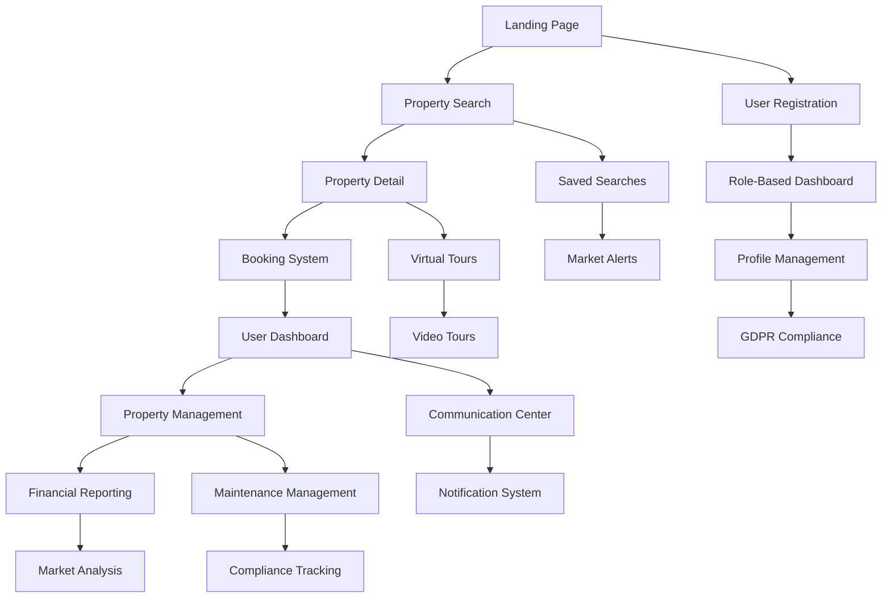

# PropertyMasters UK - Complete Implementation Requirements

**Version:** 2.0  
**Date:** December 2024  
**Project:** Multi-Tenant SaaS Property Platform Implementation  
**Document Type:** Comprehensive Product Requirements Document

---

## 1. Product Overview

PropertyMasters UK is a comprehensive multi-tenant SaaS property management platform designed to revolutionize the UK property market with advanced features and integrations. The system encompasses property management, tenant self-referencing, market analysis, virtual tours, booking systems, financial reporting, maintenance management, and compliance features specifically tailored for the UK property market.

The platform serves property agents, landlords, tenants, buyers, solicitors, and administrators with role-based access control and specialized functionality for each user type. It integrates with UK-specific services including Land Registry, Companies House, Royal Mail PAF, and Ordnance Survey for comprehensive property data and validation.

Target market value: £50M+ UK property management SaaS market with focus on automation, compliance, and user experience excellence.

## 2. Core Features

### 2.1 User Roles

| Role | Registration Method | Core Permissions |
|------|---------------------|------------------|
| Admin | System invitation with secure token | Full system access, user management, system configuration, analytics and reporting, data export/import, audit trails |
| Agent | Email registration with professional verification | Property and client management, booking management, market analysis access, commission tracking, lead management |
| Landlord | Email registration with business verification | Property portfolio management, tenant management, financial reporting, maintenance management, document management |
| Tenant | Email registration with referencing process | Profile management, rent payment, maintenance requests, document access, communication with landlord |
| Buyer | Email registration with identity verification | Property search, viewing bookings, saved searches, market analysis access, communication with agents |
| Solicitor | Professional verification with SRA number | Legal document access, transaction support, compliance verification, conveyancing tools |

### 2.2 Feature Module

Our PropertyMasters UK platform consists of the following essential pages:

1. **Landing Page**: Hero section with dynamic search, featured properties carousel, market statistics dashboard, testimonials, call-to-action areas, and UK market insights.
2. **Property Listing Page**: Advanced search filters, grid/list/map views, property cards, pagination, saved searches, market comparison tools, and area analytics.
3. **Property Detail Page**: Comprehensive property information, image gallery, virtual tours, video tours, booking calendar, contact forms, market analysis, and investment calculators.
4. **Multi-Tenant Dashboard Pages**: Role-specific dashboards with analytics, property management, financial reporting, booking management, communication centers, and performance metrics.
5. **Booking Management Page**: Interactive calendar, booking requests, availability management, notification system, booking analytics, and virtual viewing scheduling.
6. **Market Analysis Page**: Price trend charts, area analytics, investment recommendations, comparative analysis tools, market reports, and rental yield calculators.
7. **User Profile & GDPR Page**: Personal information management, document upload, preferences settings, notification controls, GDPR compliance tools, and data export/deletion.
8. **Financial Dashboard Page**: Income/expense tracking, tax reporting, profit/loss statements, cash flow analysis, payment processing, and automated invoicing.
9. **Maintenance Management Page**: Request tracking, contractor management, priority classification, cost tracking, photo documentation, and compliance monitoring.
10. **Communication Center Page**: Internal messaging, email integration, notification management, document sharing, and real-time chat functionality.

### 2.3 Page Details

| Page Name | Module Name | Feature Description |
|-----------|-------------|---------------------|
| Landing Page | Hero Section | Display dynamic property search with UK postcode autocomplete, property type filters, price range sliders, and location-based suggestions. Include featured properties carousel with high-quality images, key details, and quick actions. |
| Landing Page | Market Statistics | Show real-time UK market data including average prices by region, rental yields, market trends with interactive charts, Land Registry integration, and investment insights. |
| Landing Page | Testimonials & Trust | Display user testimonials with ratings, photos, success stories, industry certifications, and regulatory compliance badges to build trust and credibility. |
| Property Listing | Advanced Search & Filters | Implement comprehensive filtering including UK postcode search, price range, property type, bedrooms/bathrooms, amenities, availability date, EPC ratings, and custom criteria with saved search functionality. |
| Property Listing | Map Integration | Provide interactive map view with property markers, area information, transport links, local amenities, school catchment areas, and crime statistics using Ordnance Survey APIs. |
| Property Listing | Comparison Tools | Enable side-by-side property comparison, price per square foot analysis, rental yield calculations, market position analysis, and investment potential scoring. |
| Property Detail | Virtual Tours & Media | Integrate 360-degree virtual tours with VR headset compatibility, interactive hotspots, room navigation, HD video tours, image galleries, and floor plans. |
| Property Detail | Booking System | Provide calendar integration with available time slots, instant booking, booking confirmation, reminder notifications, cancellation/rescheduling, and virtual viewing options. |
| Property Detail | Market Analysis & Valuation | Display automated property valuation using Land Registry data, price history, area trends, rental yield calculations, investment potential scoring, and comparative market analysis. |
| Property Detail | Legal & Compliance | Show EPC certificates, safety certificates, planning permissions, leasehold information, and legal documentation with solicitor integration. |
| Admin Dashboard | System Management | Enable user management, system configuration, analytics and reporting, data export/import, audit trails, and multi-tenant administration. |
| Admin Dashboard | Analytics & Reporting | Provide comprehensive system analytics, user behavior tracking, financial reporting, performance metrics, and business intelligence dashboards. |
| Agent Dashboard | Property & Client Management | Support property CRUD operations, client relationship management, lead tracking, commission calculations, and performance analytics. |
| Agent Dashboard | Booking & Communication | Manage viewing bookings, client communications, follow-up scheduling, and automated marketing campaigns. |
| Landlord Dashboard | Portfolio Management | Enable property portfolio overview, performance metrics, financial reporting, tenant management, and maintenance tracking. |
| Landlord Dashboard | Financial Reporting | Generate monthly/quarterly/annual reports, income/expense tracking, tax reports, profit/loss statements, cash flow analysis, and automated invoicing. |
| Landlord Dashboard | Tenant & Tenancy Management | Provide tenancy agreement creation, rent payment tracking, tenant communication, lease management, and eviction process support. |
| Tenant Dashboard | Tenancy Information | Display rent payment history, lease information, maintenance requests, document access, and communication with landlord. |
| Tenant Dashboard | Self-Service Portal | Enable profile management, document upload, maintenance request submission, rent payments, and service requests. |
| Buyer Dashboard | Property Search & Saved | Provide advanced property search, saved searches with alerts, viewing history, shortlist management, and market analysis tools. |
| Buyer Dashboard | Viewing & Communication | Manage viewing bookings, agent communications, offer tracking, and solicitor coordination. |
| Solicitor Dashboard | Legal Documentation | Access legal documents, transaction support, compliance verification, conveyancing tools, and client communication. |
| Booking Management | Calendar Integration | Implement interactive calendar with availability management, booking approval/rejection, bulk operations, analytics, and automated scheduling. |
| Booking Management | Notification System | Send automated booking confirmations, reminders, cancellation notices, follow-up communications, and SMS notifications. |
| Market Analysis | Trend Analysis & Insights | Display UK property price trends, market demand indicators, area-specific analytics, rental yield analysis, and investment recommendations using Land Registry data. |
| Market Analysis | Comparative Analysis | Enable detailed property comparison, price per square foot analysis, amenities comparison, location scoring, and ROI calculations. |
| Financial Management | Payment Processing | Integrate Stripe for rent payments, deposits, fees, recurring payments, refunds, and automated payment collection with PCI DSS compliance. |
| Financial Management | Reporting & Analytics | Generate comprehensive financial reports, tax documentation, profit/loss statements, cash flow analysis, and audit trails. |
| Maintenance Management | Request Tracking | Support maintenance request creation, priority classification (emergency, urgent, high, medium, low), contractor assignment, progress tracking, and cost management. |
| Maintenance Management | Compliance Monitoring | Track safety certificates (gas, electrical, EPC), compliance deadlines, renewal notifications, and regulatory requirements. |
| Communication Center | Messaging System | Provide real-time messaging, message history, file attachments, read receipts, message search, and multi-party conversations. |
| Communication Center | Email Integration | Implement SMTP integration with SendGrid/AWS SES, email templates, automated notifications, email preferences, and unsubscribe functionality. |
| User Profile | Document Management | Support document upload, verification, storage, access control, version management, and GDPR-compliant data handling. |
| User Profile | GDPR Compliance | Implement consent management, data export, data deletion, privacy controls, audit trails, and right to be forgotten functionality. |
| Integration Services | UK Property APIs | Integrate Land Registry for property data, Companies House for business verification, Royal Mail PAF for address validation, and Ordnance Survey for mapping. |
| Integration Services | Third-Party Services | Connect credit checking services (Experian/Equifax), payment processing (Stripe), email services, file storage (AWS S3), and SMS notifications. |

## 3. Core Process

### 3.1 User Registration & Onboarding Flow

**Admin Flow:**
- System invitation with secure token → Profile setup → System configuration → User management access

**Agent Flow:**
- Email registration → Professional verification → Profile completion → Property listing setup → Client management access

**Landlord Flow:**
- Email registration → Business verification → Portfolio setup → Tenant management → Financial reporting access

**Tenant Flow:**
- Email registration → Identity verification → Referencing process → Tenancy setup → Portal access

**Buyer Flow:**
- Email registration → Identity verification → Preferences setup → Search criteria → Viewing bookings

**Solicitor Flow:**
- Professional verification with SRA number → Profile setup → Client connections → Legal document access

### 3.2 Property Management Flow

**Property Listing Process:**
- Property creation → Details input → Image/video upload → Virtual tour setup → Market analysis → Publishing → Marketing

**Booking & Viewing Process:**
- Property search → Viewing booking → Confirmation → Reminder notifications → Viewing completion → Feedback collection

### 3.3 Tenancy Management Flow

**Tenant Referencing Process:**
- Application submission → Document upload → Credit checks → Employment verification → Landlord references → Automated scoring → Decision

**Tenancy Lifecycle:**
- Tenancy agreement → Move-in → Rent collection → Maintenance management → Lease renewal → Move-out

### 3.4 Financial Management Flow

**Payment Processing:**
- Payment setup → Automated collection → Processing → Reconciliation → Reporting → Tax documentation

## 4. User Interface Design

### 4.1 Design Style

- **Primary Colors**: Professional Blue (#1E40AF), Clean White (#FFFFFF)
- **Secondary Colors**: Success Green (#10B981), Warning Amber (#F59E0B), Error Red (#EF4444)
- **Button Style**: Rounded corners (8px), subtle shadows, hover animations
- **Typography**: Inter font family, 16px base size, clear hierarchy
- **Layout Style**: Card-based design, top navigation, sidebar for dashboards
- **Icons**: Lucide React icons, consistent 24px size, professional style
- **Animations**: Subtle transitions, loading states, micro-interactions

### 4.2 Page Design Overview

| Page Name | Module Name | UI Elements |
|-----------|-------------|-------------|
| Landing Page | Hero Section | Full-width hero with background image, centered search bar, gradient overlay, call-to-action buttons with hover effects |
| Landing Page | Featured Properties | Responsive carousel with property cards, high-quality images, price badges, quick action buttons |
| Property Listing | Search Filters | Collapsible filter sidebar, range sliders, multi-select dropdowns, map toggle, save search functionality |
| Property Detail | Image Gallery | Full-screen image viewer, thumbnail navigation, zoom functionality, virtual tour integration |
| Dashboard | Navigation | Responsive sidebar navigation, role-based menu items, notification badges, user profile dropdown |
| Dashboard | Analytics Cards | KPI cards with icons, trend indicators, interactive charts using Chart.js, responsive grid layout |
| Booking Calendar | Interactive Calendar | Month/week/day views, color-coded bookings, drag-and-drop functionality, modal booking forms |
| Financial Reports | Charts & Tables | Interactive charts, data tables with sorting/filtering, export functionality, responsive design |

### 4.3 Responsiveness

- **Desktop-First Design**: Optimized for desktop with responsive breakpoints
- **Mobile Adaptation**: Touch-friendly interfaces, swipe gestures, mobile-optimized forms
- **Tablet Support**: Optimized layouts for tablet devices with touch interactions
- **Cross-Browser Compatibility**: Support for Chrome, Firefox, Safari, Edge

## 5. Technical Architecture

### 5.1 Frontend Architecture
- **Framework**: Next.js 14+ with TypeScript
- **Styling**: Tailwind CSS with custom design system
- **State Management**: Zustand for global state
- **UI Components**: Custom component library with Radix UI primitives
- **Charts**: Chart.js for data visualization
- **Maps**: Mapbox GL JS for interactive maps
- **Virtual Tours**: A-Frame for VR integration

### 5.2 Backend Architecture
- **Framework**: NestJS with TypeScript
- **Database**: PostgreSQL with TypeORM
- **Authentication**: JWT with Passport strategies
- **File Storage**: AWS S3 with CloudFront CDN
- **Email**: SendGrid for transactional emails
- **Payments**: Stripe for payment processing
- **Cache**: Redis for session and data caching

### 5.3 Database Schema

**Core Entities:**
- Users (with role-based permissions)
- Properties (with comprehensive details)
- Tenancies (with lifecycle management)
- Bookings (with calendar integration)
- Maintenance Requests (with tracking)
- Financial Transactions (with audit trails)
- Documents (with version control)
- Communications (with message history)

### 5.4 API Specifications

**Authentication APIs:**
- POST /api/auth/register
- POST /api/auth/login
- POST /api/auth/refresh
- POST /api/auth/forgot-password
- POST /api/auth/reset-password
- POST /api/auth/verify-email

**Property Management APIs:**
- GET /api/properties (with advanced filtering)
- POST /api/properties
- GET /api/properties/:id
- PUT /api/properties/:id
- DELETE /api/properties/:id
- GET /api/properties/search
- GET /api/properties/featured
- GET /api/properties/valuation/:id

**User Management APIs:**
- GET /api/users/profile
- PUT /api/users/profile
- GET /api/users/dashboard
- POST /api/users/documents
- GET /api/users/gdpr-export
- DELETE /api/users/gdpr-delete

**Booking APIs:**
- GET /api/bookings
- POST /api/bookings
- PUT /api/bookings/:id
- DELETE /api/bookings/:id
- GET /api/bookings/calendar
- GET /api/bookings/availability

**Financial APIs:**
- GET /api/financial/reports
- GET /api/financial/transactions
- POST /api/payments/process
- GET /api/payments/history
- POST /api/invoices/generate

**Maintenance APIs:**
- GET /api/maintenance/requests
- POST /api/maintenance/requests
- PUT /api/maintenance/requests/:id
- GET /api/maintenance/contractors
- POST /api/maintenance/photos

**Market Analysis APIs:**
- GET /api/market/trends
- GET /api/market/analysis/:postcode
- GET /api/market/comparison
- GET /api/market/valuation

**Integration APIs:**
- GET /api/integrations/land-registry/:postcode
- GET /api/integrations/companies-house/:number
- GET /api/integrations/postcode-lookup/:postcode
- GET /api/integrations/ordnance-survey/maps

### 5.5 UK-Specific Integrations

**Land Registry Integration:**
- Property price data
- Ownership history
- Title information
- Boundary data

**Companies House Integration:**
- Business verification
- Director information
- Filing history
- Company status

**Royal Mail PAF Integration:**
- Address validation
- Postcode lookup
- Delivery point data
- Address formatting

**Ordnance Survey Integration:**
- Mapping services
- Geographic data
- Location intelligence
- Spatial analysis

### 5.6 Security & Compliance

**Security Measures:**
- JWT authentication with refresh tokens
- Role-based access control (RBAC)
- API rate limiting
- Input validation and sanitization
- SQL injection prevention
- XSS protection
- HTTPS enforcement
- Security headers

**GDPR Compliance:**
- Consent management
- Data export functionality
- Right to erasure
- Data portability
- Privacy by design
- Audit trails
- Data encryption

**UK Housing Compliance:**
- Tenancy law compliance
- Deposit protection schemes
- Safety certificate tracking
- Right to rent verification
- EPC requirements

### 5.7 Performance & Scalability

**Performance Optimization:**
- Database indexing
- Query optimization
- Caching strategies
- CDN for static assets
- Image optimization
- Lazy loading
- Code splitting

**Scalability Features:**
- Horizontal scaling
- Load balancing
- Database read replicas
- Microservices architecture
- Auto-scaling groups
- Monitoring and alerting

## 6. Implementation Roadmap

### Phase 1: Core Foundation (Weeks 1-4)
- Authentication & authorization system
- User management with role-based access
- Basic property CRUD operations
- Database schema implementation
- API foundation

### Phase 2: Property Management (Weeks 5-8)
- Advanced property search and filtering
- Property detail pages
- Image and document upload
- Basic booking system
- Map integration

### Phase 3: User Dashboards (Weeks 9-12)
- Role-specific dashboards
- Analytics and reporting
- Financial management
- Communication system
- Notification system

### Phase 4: Advanced Features (Weeks 13-16)
- Virtual tours and VR integration
- Market analysis tools
- Maintenance management
- Tenant referencing system
- Payment processing

### Phase 5: UK Integrations (Weeks 17-20)
- Land Registry integration
- Companies House integration
- Royal Mail PAF integration
- Ordnance Survey integration
- Compliance features

### Phase 6: GDPR & Compliance (Weeks 21-24)
- GDPR compliance implementation
- Data protection features
- Audit trails
- Security enhancements
- Testing and optimization

## 7. Success Metrics

**User Engagement:**
- Daily/Monthly active users
- Session duration
- Feature adoption rates
- User retention rates

**Business Metrics:**
- Property listings created
- Bookings completed
- Revenue generated
- Customer satisfaction scores

**Technical Metrics:**
- API response times
- System uptime
- Error rates
- Performance benchmarks

---

**Document Control**
- **Version**: 2.0
- **Last Updated**: December 2024
- **Next Review**: March 2025
- **Approved By**: Development Team
- **Status**: Implementation Ready