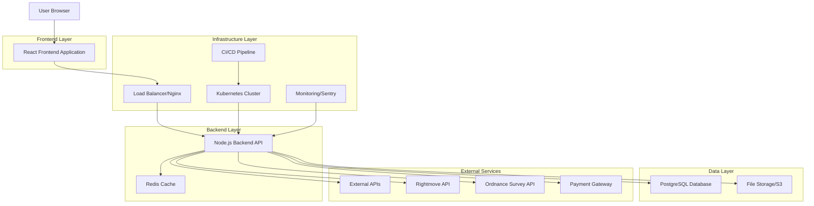
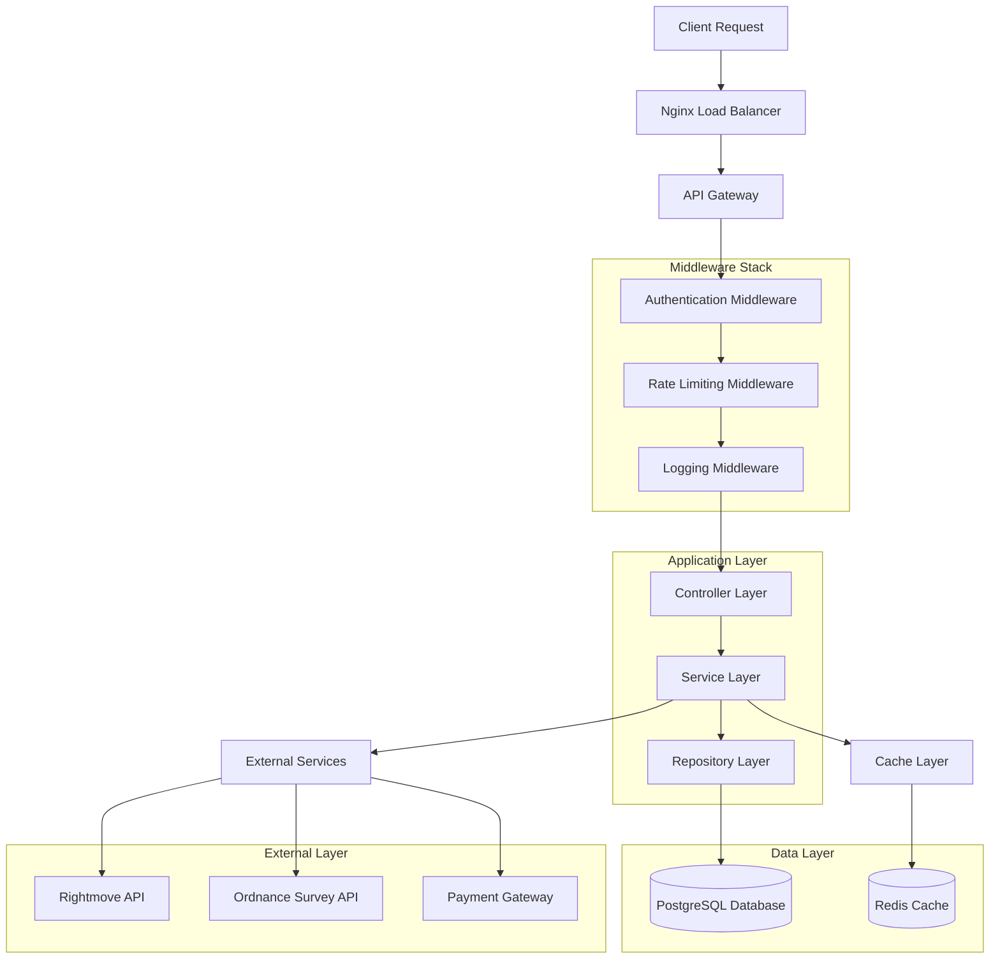
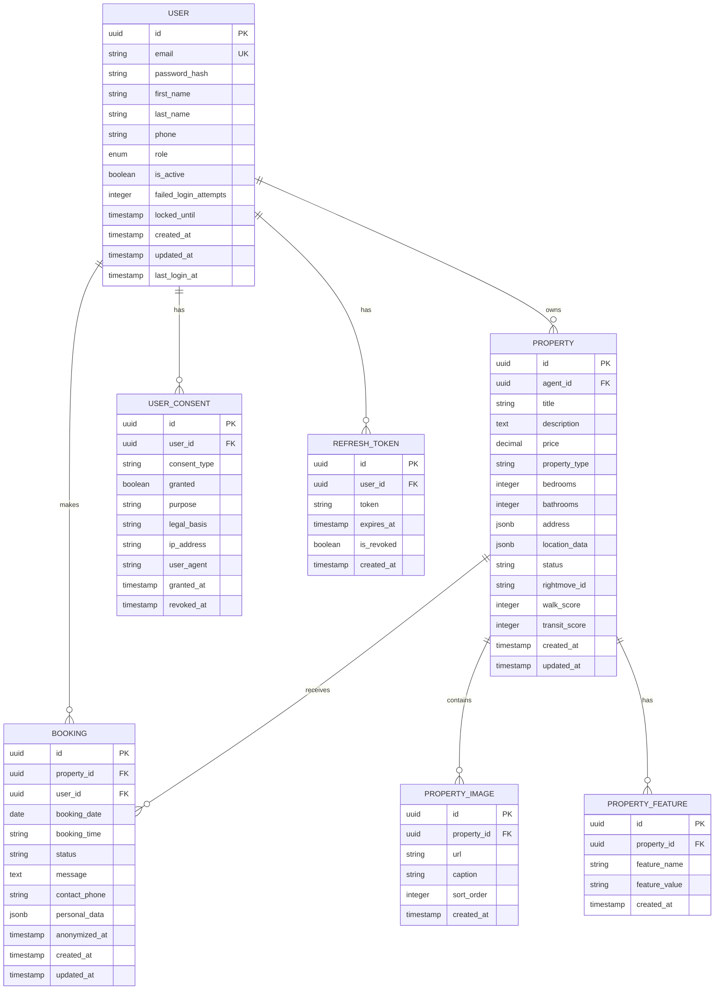

# PropertyMasters UK - Technical Architecture Document

**Project:** PropertyMasters UK Multi-tenant SaaS Property Platform  
**Version:** 2.0  
**Date:** January 2025  
**Status:** Production Ready

## 1. Architecture Design



## 2. Technology Description

### Frontend Stack
- **React@18** - Modern component-based UI framework
- **TypeScript@5** - Type-safe JavaScript development
- **Next.js@14** - Full-stack React framework with SSR/SSG
- **Tailwind CSS@3** - Utility-first CSS framework
- **Lucide React** - Modern icon library
- **React Hook Form** - Performant form handling
- **React Query** - Server state management
- **Zustand** - Client state management

### Backend Stack
- **Node.js@18** - JavaScript runtime environment
- **NestJS@10** - Progressive Node.js framework
- **TypeScript@5** - Type-safe development
- **Express@4** - Web application framework
- **TypeORM@0.3** - Object-relational mapping
- **Passport.js** - Authentication middleware
- **Winston** - Logging library
- **Jest** - Testing framework

### Database & Storage
- **PostgreSQL@14** - Primary relational database
- **Redis@7** - In-memory caching and session storage
- **AWS S3** - Object storage for images and documents

### Infrastructure & DevOps
- **Docker** - Containerization platform
- **Kubernetes** - Container orchestration
- **Nginx** - Reverse proxy and load balancer
- **GitHub Actions** - CI/CD pipeline
- **Sentry** - Error tracking and monitoring
- **Prometheus** - Metrics collection
- **Grafana** - Monitoring dashboards

### External Integrations
- **Rightmove API** - Property listing syndication
- **Ordnance Survey API** - UK mapping and location data
- **Stripe** - Payment processing
- **SendGrid** - Email delivery service

## 3. Route Definitions

### Frontend Routes
| Route | Purpose | Authentication |
|-------|---------|----------------|
| `/` | Home page with property search | Public |
| `/properties` | Property listings with filters | Public |
| `/properties/[id]` | Individual property details | Public |
| `/auth/login` | User authentication | Public |
| `/auth/register` | User registration | Public |
| `/auth/forgot-password` | Password reset | Public |
| `/dashboard` | User dashboard | Protected |
| `/dashboard/properties` | Manage user properties | Protected |
| `/dashboard/bookings` | View/manage bookings | Protected |
| `/dashboard/profile` | User profile management | Protected |
| `/admin` | Admin panel | Admin Only |
| `/admin/users` | User management | Admin Only |
| `/admin/properties` | Property moderation | Admin Only |
| `/admin/analytics` | System analytics | Admin Only |

### API Routes
| Route | Purpose | Method |
|-------|---------|--------|
| `/api/health` | Health check endpoint | GET |
| `/api/auth/login` | User authentication | POST |
| `/api/auth/register` | User registration | POST |
| `/api/auth/refresh` | Token refresh | POST |
| `/api/users/profile` | User profile operations | GET/PUT |
| `/api/properties` | Property CRUD operations | GET/POST/PUT/DELETE |
| `/api/properties/search` | Property search with filters | GET |
| `/api/bookings` | Booking management | GET/POST/PUT/DELETE |
| `/api/uploads` | File upload handling | POST |
| `/api/integrations/rightmove` | Rightmove sync | POST |
| `/api/gdpr/export` | GDPR data export | GET |
| `/api/gdpr/delete` | GDPR data deletion | DELETE |

## 4. API Definitions

### 4.1 Authentication APIs

**User Login**
```
POST /api/auth/login
```

Request:
| Param Name | Param Type | isRequired | Description |
|------------|------------|------------|-------------|
| email | string | true | User email address |
| password | string | true | User password |
| rememberMe | boolean | false | Extended session duration |

Response:
| Param Name | Param Type | Description |
|------------|------------|-------------|
| accessToken | string | JWT access token |
| refreshToken | string | JWT refresh token |
| user | object | User profile data |
| expiresIn | number | Token expiration time |

Example:
```json
{
  "email": "user@example.com",
  "password": "securePassword123"
}
```

**User Registration**
```
POST /api/auth/register
```

Request:
| Param Name | Param Type | isRequired | Description |
|------------|------------|------------|-------------|
| email | string | true | User email address |
| password | string | true | User password (min 8 chars) |
| firstName | string | true | User first name |
| lastName | string | true | User last name |
| phone | string | false | User phone number |
| role | string | false | User role (defaults to 'user') |

### 4.2 Property APIs

**Property Search**
```
GET /api/properties/search
```

Request:
| Param Name | Param Type | isRequired | Description |
|------------|------------|------------|-------------|
| location | string | false | Location search term |
| minPrice | number | false | Minimum price filter |
| maxPrice | number | false | Maximum price filter |
| propertyType | string | false | Property type filter |
| bedrooms | number | false | Number of bedrooms |
| bathrooms | number | false | Number of bathrooms |
| page | number | false | Page number for pagination |
| limit | number | false | Results per page (max 50) |

Response:
| Param Name | Param Type | Description |
|------------|------------|-------------|
| properties | array | Array of property objects |
| total | number | Total number of results |
| page | number | Current page number |
| totalPages | number | Total number of pages |

**Create Property**
```
POST /api/properties
```

Request:
| Param Name | Param Type | isRequired | Description |
|------------|------------|------------|-------------|
| title | string | true | Property title |
| description | string | true | Property description |
| price | number | true | Property price |
| propertyType | string | true | Type of property |
| bedrooms | number | true | Number of bedrooms |
| bathrooms | number | true | Number of bathrooms |
| address | object | true | Property address object |
| features | array | false | Property features list |
| images | array | false | Property image URLs |

### 4.3 Booking APIs

**Create Booking**
```
POST /api/bookings
```

Request:
| Param Name | Param Type | isRequired | Description |
|------------|------------|------------|-------------|
| propertyId | string | true | Property UUID |
| bookingDate | string | true | Booking date (ISO format) |
| bookingTime | string | true | Booking time slot |
| message | string | false | Additional message |
| contactPhone | string | true | Contact phone number |

## 5. Server Architecture Diagram



## 6. Data Model

### 6.1 Data Model Definition



### 6.2 Data Definition Language

**Users Table**
```sql
-- Create users table
CREATE TABLE users (
    id UUID PRIMARY KEY DEFAULT gen_random_uuid(),
    email VARCHAR(255) UNIQUE NOT NULL,
    password_hash VARCHAR(255) NOT NULL,
    first_name VARCHAR(100) NOT NULL,
    last_name VARCHAR(100) NOT NULL,
    phone VARCHAR(20),
    role VARCHAR(20) DEFAULT 'user' CHECK (role IN ('user', 'agent', 'admin')),
    is_active BOOLEAN DEFAULT true,
    failed_login_attempts INTEGER DEFAULT 0,
    locked_until TIMESTAMP WITH TIME ZONE,
    created_at TIMESTAMP WITH TIME ZONE DEFAULT NOW(),
    updated_at TIMESTAMP WITH TIME ZONE DEFAULT NOW(),
    last_login_at TIMESTAMP WITH TIME ZONE
);

-- Create indexes
CREATE INDEX idx_users_email ON users(email);
CREATE INDEX idx_users_role ON users(role);
CREATE INDEX idx_users_active ON users(is_active);
CREATE INDEX idx_users_created_at ON users(created_at DESC);
```

**Properties Table**
```sql
-- Create properties table
CREATE TABLE properties (
    id UUID PRIMARY KEY DEFAULT gen_random_uuid(),
    agent_id UUID NOT NULL REFERENCES users(id) ON DELETE CASCADE,
    title VARCHAR(255) NOT NULL,
    description TEXT NOT NULL,
    price DECIMAL(12,2) NOT NULL,
    property_type VARCHAR(50) NOT NULL,
    bedrooms INTEGER NOT NULL,
    bathrooms INTEGER NOT NULL,
    address JSONB NOT NULL,
    location_data JSONB,
    status VARCHAR(20) DEFAULT 'draft' CHECK (status IN ('draft', 'active', 'sold', 'let', 'withdrawn')),
    rightmove_id VARCHAR(100),
    walk_score INTEGER,
    transit_score INTEGER,
    created_at TIMESTAMP WITH TIME ZONE DEFAULT NOW(),
    updated_at TIMESTAMP WITH TIME ZONE DEFAULT NOW()
);

-- Create indexes
CREATE INDEX idx_properties_agent ON properties(agent_id);
CREATE INDEX idx_properties_status ON properties(status);
CREATE INDEX idx_properties_type ON properties(property_type);
CREATE INDEX idx_properties_price ON properties(price);
CREATE INDEX idx_properties_bedrooms ON properties(bedrooms);
CREATE INDEX idx_properties_created_at ON properties(created_at DESC);
CREATE INDEX idx_properties_location ON properties USING GIN(address);
CREATE INDEX idx_properties_rightmove ON properties(rightmove_id);
```

**Bookings Table**
```sql
-- Create bookings table
CREATE TABLE bookings (
    id UUID PRIMARY KEY DEFAULT gen_random_uuid(),
    property_id UUID NOT NULL REFERENCES properties(id) ON DELETE CASCADE,
    user_id UUID REFERENCES users(id) ON DELETE SET NULL,
    booking_date DATE NOT NULL,
    booking_time VARCHAR(20) NOT NULL,
    status VARCHAR(20) DEFAULT 'pending' CHECK (status IN ('pending', 'confirmed', 'cancelled', 'completed')),
    message TEXT,
    contact_phone VARCHAR(20) NOT NULL,
    personal_data JSONB,
    anonymized_at TIMESTAMP WITH TIME ZONE,
    created_at TIMESTAMP WITH TIME ZONE DEFAULT NOW(),
    updated_at TIMESTAMP WITH TIME ZONE DEFAULT NOW()
);

-- Create indexes
CREATE INDEX idx_bookings_property ON bookings(property_id);
CREATE INDEX idx_bookings_user ON bookings(user_id);
CREATE INDEX idx_bookings_date ON bookings(booking_date);
CREATE INDEX idx_bookings_status ON bookings(status);
CREATE INDEX idx_bookings_created_at ON bookings(created_at DESC);
```

**Property Images Table**
```sql
-- Create property_images table
CREATE TABLE property_images (
    id UUID PRIMARY KEY DEFAULT gen_random_uuid(),
    property_id UUID NOT NULL REFERENCES properties(id) ON DELETE CASCADE,
    url VARCHAR(500) NOT NULL,
    caption VARCHAR(255),
    sort_order INTEGER DEFAULT 0,
    created_at TIMESTAMP WITH TIME ZONE DEFAULT NOW()
);

-- Create indexes
CREATE INDEX idx_property_images_property ON property_images(property_id);
CREATE INDEX idx_property_images_sort ON property_images(property_id, sort_order);
```

**User Consents Table**
```sql
-- Create user_consents table
CREATE TABLE user_consents (
    id UUID PRIMARY KEY DEFAULT gen_random_uuid(),
    user_id UUID NOT NULL REFERENCES users(id) ON DELETE CASCADE,
    consent_type VARCHAR(50) NOT NULL,
    granted BOOLEAN NOT NULL,
    purpose VARCHAR(255),
    legal_basis VARCHAR(100),
    ip_address INET,
    user_agent TEXT,
    granted_at TIMESTAMP WITH TIME ZONE DEFAULT NOW(),
    revoked_at TIMESTAMP WITH TIME ZONE
);

-- Create indexes
CREATE INDEX idx_user_consents_user ON user_consents(user_id);
CREATE INDEX idx_user_consents_type ON user_consents(consent_type);
CREATE INDEX idx_user_consents_granted ON user_consents(granted_at DESC);
```

**Refresh Tokens Table**
```sql
-- Create refresh_tokens table
CREATE TABLE refresh_tokens (
    id UUID PRIMARY KEY DEFAULT gen_random_uuid(),
    user_id UUID NOT NULL REFERENCES users(id) ON DELETE CASCADE,
    token VARCHAR(500) NOT NULL,
    expires_at TIMESTAMP WITH TIME ZONE NOT NULL,
    is_revoked BOOLEAN DEFAULT false,
    created_at TIMESTAMP WITH TIME ZONE DEFAULT NOW()
);

-- Create indexes
CREATE INDEX idx_refresh_tokens_user ON refresh_tokens(user_id);
CREATE INDEX idx_refresh_tokens_token ON refresh_tokens(token);
CREATE INDEX idx_refresh_tokens_expires ON refresh_tokens(expires_at);
```

**Initial Data**
```sql
-- Insert admin user
INSERT INTO users (email, password_hash, first_name, last_name, role) VALUES
('admin@propertymastersuk.com', '$2b$10$encrypted_password_hash', 'System', 'Administrator', 'admin');

-- Insert sample property types
INSERT INTO properties (agent_id, title, description, price, property_type, bedrooms, bathrooms, address, status)
SELECT 
    (SELECT id FROM users WHERE role = 'admin' LIMIT 1),
    'Sample Property',
    'A beautiful sample property for demonstration purposes.',
    250000.00,
    'house',
    3,
    2,
    '{"street": "123 Sample Street", "city": "London", "postcode": "SW1A 1AA", "country": "UK"}',
    'active'
WHERE NOT EXISTS (SELECT 1 FROM properties);
```

---

## Security Considerations

### Authentication & Authorization
- JWT-based authentication with refresh tokens
- Role-based access control (RBAC)
- Account lockout after failed login attempts
- Password complexity requirements
- Session management and timeout

### Data Protection
- GDPR compliance with data export/deletion
- Encryption at rest and in transit
- PII data anonymization
- Secure file upload handling
- Input validation and sanitization

### Infrastructure Security
- HTTPS enforcement
- Security headers (HSTS, CSP, etc.)
- Rate limiting and DDoS protection
- Container security scanning
- Regular security updates

## Performance Optimization

### Caching Strategy
- Redis for session storage
- Query result caching
- CDN for static assets
- Browser caching headers

### Database Optimization
- Proper indexing strategy
- Connection pooling
- Query optimization
- Read replicas for scaling

### Monitoring & Observability
- Application performance monitoring
- Error tracking with Sentry
- Structured logging
- Health check endpoints
- Metrics collection and alerting

---

*This technical architecture document provides the foundation for a scalable, secure, and maintainable PropertyMasters UK platform.*