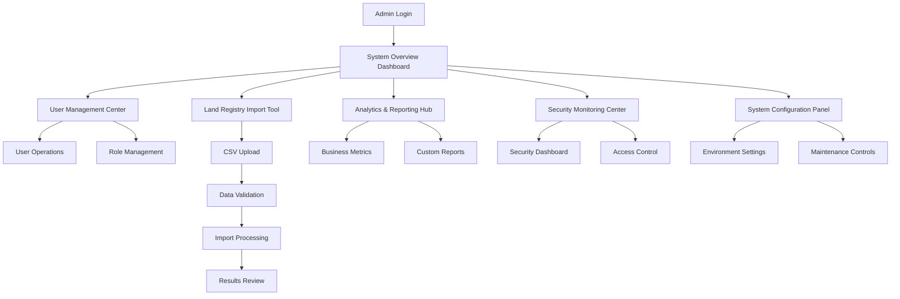

# Admin Dashboard Enhancement - Product Requirements Document

## 1. Product Overview

Enhance the PropertyMasters UK admin dashboard to provide comprehensive system administration capabilities, including full user management, system monitoring, GDPR compliance tools, and Land Registry CSV data import functionality. This enhancement transforms the basic admin interface into a powerful administrative control center that enables efficient platform management and data operations.

The enhanced dashboard addresses critical gaps in administrative functionality, providing admins with complete oversight of users, system performance, compliance requirements, and bulk data management capabilities essential for platform scalability and regulatory compliance.

## 2. Core Features

### 2.1 User Roles

| Role | Registration Method | Core Permissions |
|------|---------------------|------------------|
| Super Admin | System-created account | Full system access, user management, system configuration, data import/export |
| Admin | Invitation by Super Admin | User management, reporting, compliance monitoring, limited system configuration |
| System Operator | Invitation by Admin/Super Admin | System monitoring, maintenance oversight, integration management |

### 2.2 Feature Module

Our admin dashboard enhancement consists of the following main pages:

1. **System Overview Dashboard**: Real-time system health, performance metrics, active sessions, and critical alerts
2. **User Management Center**: Complete user CRUD operations, role management, bulk actions, and account verification
3. **System Configuration Panel**: Environment settings, feature flags, API configurations, and maintenance mode controls
4. **Analytics & Reporting Hub**: Business intelligence dashboards, user analytics, property performance, and custom reports
5. **GDPR Compliance Center**: Data protection monitoring, consent management, privacy controls, and compliance reporting
6. **Financial Management Dashboard**: Revenue tracking, transaction monitoring, audit trails, and financial reporting
7. **Maintenance Oversight Panel**: System maintenance scheduling, property maintenance monitoring, and contractor management
8. **Integration Services Manager**: API health monitoring, service configuration, webhook management, and third-party integrations
9. **Security Monitoring Center**: Security alerts, failed login tracking, IP management, and incident response
10. **Land Registry Import Tool**: CSV upload interface, data validation, import progress tracking, and error reporting

### 2.3 Page Details

| Page Name | Module Name | Feature description |
|-----------|-------------|---------------------|
| System Overview Dashboard | Health Monitoring | Display real-time server metrics (CPU, memory, disk), database status, API response times, active user sessions |
| System Overview Dashboard | Alert Management | Show critical system alerts, maintenance notifications, security warnings with priority levels and action buttons |
| System Overview Dashboard | Quick Actions | Provide one-click access to common admin tasks: user creation, system maintenance, backup initiation |
| User Management Center | User Directory | List all users with search, filter, sort capabilities; display user status, roles, last login, registration date |
| User Management Center | User Operations | Create, edit, delete users; change roles; bulk activate/deactivate; password reset; account verification |
| User Management Center | Role Management | Define custom roles, assign permissions, manage role hierarchy, audit role changes |
| System Configuration Panel | Environment Settings | Manage system-wide configurations, feature toggles, API keys, email templates, notification settings |
| System Configuration Panel | Maintenance Controls | Schedule system maintenance, enable maintenance mode, configure backup schedules, manage log retention |
| Analytics & Reporting Hub | Business Metrics | Display user growth, property listing trends, booking conversion rates, revenue analytics with interactive charts |
| Analytics & Reporting Hub | Custom Reports | Generate custom reports with date ranges, filters, export options (PDF, Excel, CSV) |
| Analytics & Reporting Hub | Performance Analytics | Monitor API usage, error rates, response times, user engagement metrics |
| GDPR Compliance Center | Data Protection Dashboard | Track data processing activities, consent status, data retention compliance, privacy policy versions |
| GDPR Compliance Center | Request Management | Handle data subject requests (access, portability, erasure), track request status, generate compliance reports |
| Financial Management Dashboard | Revenue Tracking | Monitor transaction volumes, commission calculations, payment gateway status, refund management |
| Financial Management Dashboard | Audit Trails | Complete financial audit logs, transaction history, user payment activities, compliance reporting |
| Maintenance Oversight Panel | System Maintenance | Schedule database optimization, cache clearing, log rotation, backup verification |
| Maintenance Oversight Panel | Property Maintenance | Global view of property maintenance requests, contractor performance, cost analysis |
| Integration Services Manager | API Monitoring | Monitor Land Registry, Companies House, Royal Mail PAF, payment gateway APIs with status indicators |
| Integration Services Manager | Service Configuration | Manage API credentials, rate limits, webhook endpoints, service timeouts |
| Security Monitoring Center | Security Dashboard | Display failed login attempts, suspicious activities, blocked IPs, security incident timeline |
| Security Monitoring Center | Access Control | Manage IP whitelisting, session timeouts, MFA settings, security policies |
| Land Registry Import Tool | File Upload Interface | Drag-and-drop CSV upload with file validation, size limits, format checking |
| Land Registry Import Tool | Data Validation | Real-time CSV validation, column mapping, data type checking, duplicate detection |
| Land Registry Import Tool | Import Processing | Progress tracking, batch processing status, error reporting, import history |
| Land Registry Import Tool | Error Management | Detailed error reports, line-by-line validation results, correction suggestions, retry mechanisms |

## 3. Core Process

### Admin User Flow

1. **Dashboard Access**: Admin logs in and lands on System Overview Dashboard showing real-time system health and alerts
2. **Daily Operations**: Admin reviews system status, checks user activities, monitors security alerts, and handles urgent issues
3. **User Management**: Admin navigates to User Management Center to create new users, modify roles, or handle account issues
4. **Data Import**: Admin uses Land Registry Import Tool to upload CSV files, monitor processing, and review results
5. **Reporting**: Admin generates compliance reports, financial summaries, and performance analytics
6. **System Maintenance**: Admin schedules maintenance tasks, configures system settings, and monitors integrations

### Land Registry CSV Import Flow

1. **File Preparation**: Admin prepares CSV file with required Land Registry data columns
2. **Upload Process**: Admin drags CSV file to upload interface, system validates file format and size
3. **Data Validation**: System performs real-time validation, shows column mapping interface, highlights errors
4. **Import Configuration**: Admin configures data mapping, sets processing options, confirms import settings
5. **Processing**: System processes CSV in batches, shows real-time progress, handles errors gracefully
6. **Results Review**: Admin reviews import results, downloads error reports, verifies data accuracy
7. **Data Verification**: Admin uses analytics tools to verify imported data integrity and completeness

## 4. User Interface Design

### 4.1 Design Style

- **Primary Colors**: Deep blue (#1e40af) for headers and primary actions, light blue (#3b82f6) for secondary elements
- **Secondary Colors**: Gray scale (#f8fafc to #1e293b) for backgrounds and text, green (#10b981) for success states, red (#ef4444) for errors, amber (#f59e0b) for warnings
- **Button Style**: Rounded corners (8px radius), subtle shadows, hover animations, consistent sizing (sm: 32px, md: 40px, lg: 48px height)
- **Font**: Inter font family, 14px base size, 16px for body text, 12px for captions, bold weights for headings
- **Layout Style**: Card-based design with subtle borders, consistent 16px padding, 24px gaps between sections, sidebar navigation with collapsible sections
- **Icons**: Heroicons outline style for consistency, 20px standard size, 16px for small contexts, 24px for prominent actions

### 4.2 Page Design Overview

| Page Name | Module Name | UI Elements |
|-----------|-------------|-------------|
| System Overview Dashboard | Health Monitoring | Grid layout with metric cards, real-time charts using Chart.js, color-coded status indicators (green/amber/red), responsive design for mobile viewing |
| System Overview Dashboard | Alert Management | Alert banner at top, expandable alert list with severity icons, action buttons (Acknowledge, Resolve), timestamp formatting |
| User Management Center | User Directory | Data table with sorting/filtering, search bar with autocomplete, pagination controls, bulk action checkboxes, user avatar placeholders |
| User Management Center | User Operations | Modal dialogs for user forms, multi-step role assignment wizard, confirmation dialogs for destructive actions, inline editing capabilities |
| System Configuration Panel | Environment Settings | Tabbed interface for different config categories, toggle switches for feature flags, secure input fields for API keys, validation feedback |
| Analytics & Reporting Hub | Business Metrics | Interactive dashboard with Chart.js/D3.js visualizations, date range picker, metric comparison tools, export buttons |
| GDPR Compliance Center | Data Protection Dashboard | Compliance status cards with progress bars, timeline view for data requests, document upload interface, consent tracking tables |
| Financial Management Dashboard | Revenue Tracking | Financial charts with drill-down capabilities, transaction tables with advanced filtering, export functionality, currency formatting |
| Security Monitoring Center | Security Dashboard | Real-time activity feed, geographic IP visualization, threat level indicators, incident response workflow interface |
| Land Registry Import Tool | File Upload Interface | Drag-and-drop zone with file preview, progress bars for upload/processing, validation status indicators, error highlighting |
| Land Registry Import Tool | Data Validation | Column mapping interface with dropdown selectors, validation results table, error summary panel, correction suggestions |

### 4.3 Responsiveness

The admin dashboard is desktop-first with mobile-adaptive design considerations:

- **Desktop Optimization**: Full sidebar navigation, multi-column layouts, detailed data tables, comprehensive dashboards
- **Tablet Adaptation**: Collapsible sidebar, responsive grid layouts, touch-friendly controls, optimized table scrolling
- **Mobile Considerations**: Hamburger menu navigation, stacked layouts, simplified data views, touch gesture support
- **Accessibility**: WCAG 2.1 AA compliance, keyboard navigation, screen reader support, high contrast mode, focus indicators
- **Performance**: Lazy loading for dashboard components, optimized images, efficient data fetching, progressive enhancement

## 5. Technical Requirements

### 5.1 Performance Requirements

- Dashboard load time: < 2 seconds for initial view
- CSV import processing: Support files up to 50MB with progress tracking
- Real-time updates: WebSocket connections for live system metrics
- Concurrent users: Support 50+ simultaneous admin users
- Data export: Generate reports within 30 seconds for standard datasets

### 5.2 Security Requirements

- Multi-factor authentication for all admin accounts
- Role-based access control with granular permissions
- Audit logging for all administrative actions
- Secure file upload with virus scanning
- IP address whitelisting for admin access
- Session timeout and automatic logout

### 5.3 Integration Requirements

- Seamless integration with existing Supabase authentication
- Real-time synchronization with Land Registry API
- Integration with existing property management system
- Email notification system for alerts and reports
- Backup and disaster recovery procedures

### 5.4 Compliance Requirements

- GDPR compliance for data processing and storage
- UK housing regulation compliance for property data
- Financial regulation compliance for transaction handling
- Data retention policies and automated cleanup
- Privacy by design principles throughout the system

## 6. Success Metrics

### 6.1 User Adoption Metrics

- Admin user engagement: Daily active admin users > 80%
- Feature utilization: All major features used weekly
- User satisfaction: Admin feedback score > 4.5/5
- Training completion: 100% admin user onboarding

### 6.2 Operational Metrics

- System uptime: 99.9% availability
- Data import success rate: > 95% for valid CSV files
- Error resolution time: < 4 hours for critical issues
- Compliance audit success: 100% regulatory compliance

### 6.3 Business Impact Metrics

- Administrative efficiency: 50% reduction in manual tasks
- Data quality improvement: 90% reduction in data errors
- Compliance cost reduction: 30% decrease in compliance overhead
- User management efficiency: 60% faster user onboarding process

---

**Document Version**: 1.0  
**Last Updated**: December 2024  
**Next Review**: January 2025  
**Status**: Active