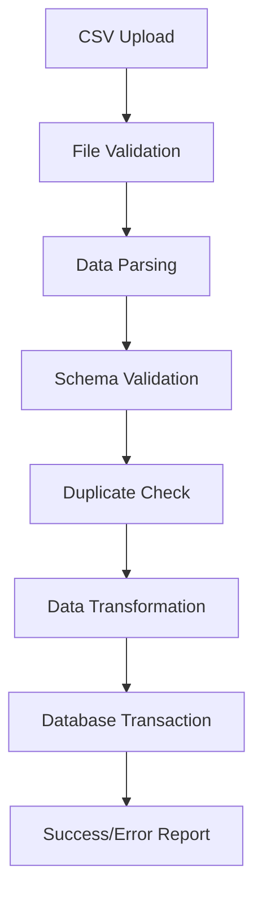

# Admin Dashboard Enhancement Technical Specification

**Version:** 1.0  
**Date:** December 2024  
**Project:** PropertyMasters UK - Admin Dashboard Enhancement  
**Document Type:** Technical Specification

---

## 1. Overview

This document provides comprehensive technical specifications for enhancing the PropertyMasters UK admin dashboard to include all required functionalities as outlined in the SRS document, with a focus on implementing Land Registry CSV import capabilities and complete admin role management.

### 1.1 Current State Analysis

Based on the existing admin dashboard implementation, the following functionalities are missing:
- Complete user management with role changes
- System configuration management
- GDPR compliance management
- Financial reporting and audit trails
- Maintenance management oversight
- Integration services management
- Security monitoring and alerts
- Land Registry data import functionality

### 1.2 Enhancement Objectives

- Implement full admin role capabilities as per SRS requirements
- Add Land Registry CSV import functionality
- Enhance system monitoring and configuration
- Improve data management and reporting capabilities

---

## 2. Admin Dashboard Enhancement Requirements

### 2.1 Full System Access Capabilities

#### 2.1.1 System Overview Dashboard
**Components:**
- Real-time system health monitoring
- Server performance metrics (CPU, memory, disk usage)
- Database connection status
- API response times
- Active user sessions
- System uptime statistics

#### 2.1.2 System Configuration Management
**Features:**
- Environment variable management
- Feature flag controls
- API rate limiting configuration
- Email template management
- System maintenance mode toggle

### 2.2 Enhanced User Management

#### 2.2.1 User CRUD Operations
**Capabilities:**
- Create new users with role assignment
- Edit user profiles and permissions
- Bulk user operations (activate/deactivate)
- User role changes with audit logging
- Password reset functionality
- Account verification management

#### 2.2.2 Role Management
**Features:**
- Dynamic role creation and modification
- Permission matrix management
- Role-based access control configuration
- Custom permission assignments

### 2.3 Analytics and Reporting Dashboards

#### 2.3.1 Business Intelligence
**Metrics:**
- User growth and retention analytics
- Property listing performance
- Revenue and transaction analytics
- Booking conversion rates
- Geographic distribution analysis

#### 2.3.2 System Analytics
**Monitoring:**
- API usage statistics
- Error rate monitoring
- Performance bottleneck identification
- Security incident tracking

### 2.4 GDPR Compliance Management

#### 2.4.1 Data Protection Dashboard
**Features:**
- Data processing activity logs
- Consent management overview
- Data retention policy monitoring
- Right to erasure request handling
- Data portability request management

#### 2.4.2 Privacy Controls
**Capabilities:**
- Cookie consent management
- Data anonymization tools
- Privacy policy version control
- Compliance audit trails

### 2.5 Financial Reporting and Audit Trails

#### 2.5.1 Financial Dashboard
**Components:**
- Revenue tracking and forecasting
- Transaction monitoring
- Payment gateway status
- Refund and chargeback management
- Commission calculations

#### 2.5.2 Audit Management
**Features:**
- Complete audit trail logging
- User action tracking
- Data modification history
- Security event logging
- Compliance report generation

### 2.6 Maintenance Management Oversight

#### 2.6.1 System Maintenance
**Tools:**
- Scheduled maintenance planning
- Database optimization tools
- Cache management
- Log file management
- Backup and recovery monitoring

#### 2.6.2 Property Maintenance Oversight
**Features:**
- Global maintenance request dashboard
- Contractor performance analytics
- Maintenance cost analysis
- Priority escalation management

### 2.7 Integration Services Management

#### 2.7.1 API Integration Dashboard
**Monitoring:**
- Land Registry API status
- Companies House API health
- Royal Mail PAF service status
- Payment gateway connectivity
- Third-party service performance

#### 2.7.2 Integration Configuration
**Management:**
- API key management
- Rate limiting configuration
- Webhook management
- Service endpoint configuration

### 2.8 Security Monitoring and Alerts

#### 2.8.1 Security Dashboard
**Features:**
- Failed login attempt monitoring
- Suspicious activity detection
- IP address blocking management
- Security incident response
- Vulnerability assessment results

#### 2.8.2 Alert Management
**Capabilities:**
- Real-time security alerts
- System performance alerts
- Business metric alerts
- Custom alert configuration

---

## 3. Land Registry CSV Import Feature

### 3.1 Feature Overview

Implement a comprehensive CSV import system for Land Registry data that allows administrators to bulk upload property data, ownership records, and price history information.

### 3.2 CSV File Upload Interface

#### 3.2.1 Upload Component
**Frontend Implementation:**
```typescript
interface CSVUploadProps {
  onUpload: (file: File) => void;
  acceptedFormats: string[];
  maxFileSize: number;
  isUploading: boolean;
}

const CSVUploadComponent: React.FC<CSVUploadProps> = ({
  onUpload,
  acceptedFormats,
  maxFileSize,
  isUploading
}) => {
  // Drag and drop file upload
  // File validation
  // Progress indicator
  // Error handling
};
```

#### 3.2.2 File Validation
**Validation Rules:**
- File format: CSV only
- Maximum file size: 50MB
- Required columns validation
- Data type validation
- Duplicate detection

### 3.3 Data Validation and Parsing

#### 3.3.1 CSV Schema Definition
**Required Columns:**
- UPRN (Unique Property Reference Number)
- Address Line 1
- Address Line 2 (optional)
- City
- Postcode
- Property Type
- Tenure Type
- Price (optional)
- Transaction Date (optional)
- Title Number (optional)

#### 3.3.2 Validation Rules
**Data Validation:**
- UPRN format validation (numeric, 12 digits)
- Postcode format validation (UK format)
- Property type enumeration validation
- Price format validation (numeric, positive)
- Date format validation (ISO 8601)

### 3.4 Database Population Workflow

#### 3.4.1 Import Process Flow


#### 3.4.2 Database Operations
**Import Strategy:**
- Batch processing for large files
- Transaction rollback on errors
- Upsert operations for existing records
- Audit trail creation
- Progress tracking

### 3.5 Error Handling and Reporting

#### 3.5.1 Error Types
**Validation Errors:**
- Invalid file format
- Missing required columns
- Invalid data types
- Constraint violations
- Duplicate records

#### 3.5.2 Error Reporting
**Report Format:**
- Line-by-line error details
- Error categorization
- Suggested corrections
- Downloadable error report
- Success/failure statistics

### 3.6 Progress Tracking

#### 3.6.1 Real-time Progress
**Features:**
- File upload progress
- Processing progress
- Records processed count
- Estimated completion time
- Cancel operation capability

#### 3.6.2 Import History
**Tracking:**
- Import job history
- User who initiated import
- File details and statistics
- Success/failure rates
- Processing duration

### 3.7 Data Mapping Configuration

#### 3.7.1 Column Mapping
**Features:**
- Flexible column mapping interface
- Custom field mapping
- Data transformation rules
- Default value assignment
- Conditional mapping logic

#### 3.7.2 Import Templates
**Templates:**
- Predefined mapping templates
- Custom template creation
- Template sharing and export
- Version control for templates

---

## 4. Technical Architecture

### 4.1 Frontend Components Structure

#### 4.1.1 Admin Dashboard Layout
```
src/pages/admin/
├── AdminDashboard.tsx (main dashboard)
├── components/
│   ├── SystemOverview.tsx
│   ├── UserManagement.tsx
│   ├── SystemConfiguration.tsx
│   ├── GDPRCompliance.tsx
│   ├── FinancialReporting.tsx
│   ├── MaintenanceOversight.tsx
│   ├── IntegrationServices.tsx
│   ├── SecurityMonitoring.tsx
│   └── LandRegistryImport.tsx
├── modals/
│   ├── UserEditModal.tsx
│   ├── RoleManagementModal.tsx
│   ├── SystemConfigModal.tsx
│   └── ImportProgressModal.tsx
└── hooks/
    ├── useAdminDashboard.ts
    ├── useUserManagement.ts
    ├── useSystemConfig.ts
    └── useLandRegistryImport.ts
```

#### 4.1.2 Component Hierarchy
```typescript
interface AdminDashboardProps {
  user: User;
  permissions: Permission[];
}

const AdminDashboard: React.FC<AdminDashboardProps> = ({ user, permissions }) => {
  const [activeTab, setActiveTab] = useState('overview');
  const [systemMetrics, setSystemMetrics] = useState<SystemMetrics>();
  
  return (
    <div className="admin-dashboard">
      <AdminSidebar activeTab={activeTab} onTabChange={setActiveTab} />
      <AdminContent activeTab={activeTab} systemMetrics={systemMetrics} />
    </div>
  );
};
```

### 4.2 Backend API Endpoints

#### 4.2.1 Admin Management APIs
```typescript
// User Management
GET    /api/admin/users
POST   /api/admin/users
PUT    /api/admin/users/:id
DELETE /api/admin/users/:id
POST   /api/admin/users/:id/change-role
POST   /api/admin/users/bulk-action

// System Configuration
GET    /api/admin/config
PUT    /api/admin/config
GET    /api/admin/config/environment
PUT    /api/admin/config/environment

// Analytics and Reporting
GET    /api/admin/analytics/dashboard
GET    /api/admin/analytics/users
GET    /api/admin/analytics/properties
GET    /api/admin/analytics/financial
GET    /api/admin/reports/export

// GDPR Compliance
GET    /api/admin/gdpr/requests
POST   /api/admin/gdpr/process-request
GET    /api/admin/gdpr/audit-log
GET    /api/admin/gdpr/compliance-status

// Security Monitoring
GET    /api/admin/security/alerts
GET    /api/admin/security/failed-logins
POST   /api/admin/security/block-ip
GET    /api/admin/security/audit-log
```

#### 4.2.2 Land Registry Import APIs
```typescript
// CSV Import
POST   /api/admin/land-registry/import/upload
GET    /api/admin/land-registry/import/status/:jobId
GET    /api/admin/land-registry/import/history
GET    /api/admin/land-registry/import/download-errors/:jobId
POST   /api/admin/land-registry/import/cancel/:jobId

// Data Management
GET    /api/admin/land-registry/data/summary
GET    /api/admin/land-registry/data/validation-rules
POST   /api/admin/land-registry/data/validate
POST   /api/admin/land-registry/data/transform
```

### 4.3 Database Schema Updates

#### 4.3.1 Admin Activity Logging
```sql
CREATE TABLE admin_activity_logs (
  id UUID PRIMARY KEY DEFAULT uuid_generate_v4(),
  admin_user_id UUID REFERENCES users(id),
  action VARCHAR(100) NOT NULL,
  resource_type VARCHAR(50) NOT NULL,
  resource_id VARCHAR(255),
  details JSONB,
  ip_address INET,
  user_agent TEXT,
  created_at TIMESTAMP DEFAULT CURRENT_TIMESTAMP
);

CREATE INDEX idx_admin_activity_logs_user_id ON admin_activity_logs(admin_user_id);
CREATE INDEX idx_admin_activity_logs_action ON admin_activity_logs(action);
CREATE INDEX idx_admin_activity_logs_created_at ON admin_activity_logs(created_at DESC);
```

#### 4.3.2 CSV Import Job Tracking
```sql
CREATE TABLE csv_import_jobs (
  id UUID PRIMARY KEY DEFAULT uuid_generate_v4(),
  user_id UUID REFERENCES users(id),
  file_name VARCHAR(255) NOT NULL,
  file_size BIGINT NOT NULL,
  total_records INTEGER,
  processed_records INTEGER DEFAULT 0,
  successful_records INTEGER DEFAULT 0,
  failed_records INTEGER DEFAULT 0,
  status VARCHAR(20) DEFAULT 'pending',
  error_report_url VARCHAR(500),
  started_at TIMESTAMP,
  completed_at TIMESTAMP,
  created_at TIMESTAMP DEFAULT CURRENT_TIMESTAMP
);

CREATE INDEX idx_csv_import_jobs_user_id ON csv_import_jobs(user_id);
CREATE INDEX idx_csv_import_jobs_status ON csv_import_jobs(status);
CREATE INDEX idx_csv_import_jobs_created_at ON csv_import_jobs(created_at DESC);
```

#### 4.3.3 System Configuration
```sql
CREATE TABLE system_configurations (
  id UUID PRIMARY KEY DEFAULT uuid_generate_v4(),
  config_key VARCHAR(100) UNIQUE NOT NULL,
  config_value JSONB NOT NULL,
  description TEXT,
  is_sensitive BOOLEAN DEFAULT FALSE,
  updated_by UUID REFERENCES users(id),
  created_at TIMESTAMP DEFAULT CURRENT_TIMESTAMP,
  updated_at TIMESTAMP DEFAULT CURRENT_TIMESTAMP
);

CREATE INDEX idx_system_configurations_key ON system_configurations(config_key);
```

### 4.4 File Processing Workflow

#### 4.4.1 CSV Processing Service
```typescript
@Injectable()
export class CSVProcessingService {
  async processLandRegistryCSV(file: Express.Multer.File, userId: string): Promise<ImportJob> {
    // 1. Create import job record
    const job = await this.createImportJob(file, userId);
    
    // 2. Queue processing job
    await this.queueService.add('process-csv', {
      jobId: job.id,
      filePath: file.path,
      userId
    });
    
    return job;
  }
  
  @Process('process-csv')
  async handleCSVProcessing(job: Job<CSVProcessingData>) {
    const { jobId, filePath, userId } = job.data;
    
    try {
      // 1. Parse CSV file
      const records = await this.parseCSVFile(filePath);
      
      // 2. Validate records
      const validationResults = await this.validateRecords(records);
      
      // 3. Process valid records
      await this.processValidRecords(validationResults.valid, jobId);
      
      // 4. Generate error report for invalid records
      if (validationResults.invalid.length > 0) {
        await this.generateErrorReport(validationResults.invalid, jobId);
      }
      
      // 5. Update job status
      await this.updateJobStatus(jobId, 'completed');
      
    } catch (error) {
      await this.updateJobStatus(jobId, 'failed', error.message);
    }
  }
}
```

#### 4.4.2 Data Validation Service
```typescript
@Injectable()
export class DataValidationService {
  validateLandRegistryRecord(record: any): ValidationResult {
    const errors: string[] = [];
    
    // UPRN validation
    if (!record.uprn || !/^\d{12}$/.test(record.uprn)) {
      errors.push('Invalid UPRN format');
    }
    
    // Postcode validation
    if (!record.postcode || !this.isValidUKPostcode(record.postcode)) {
      errors.push('Invalid UK postcode format');
    }
    
    // Property type validation
    if (!record.propertyType || !this.isValidPropertyType(record.propertyType)) {
      errors.push('Invalid property type');
    }
    
    return {
      isValid: errors.length === 0,
      errors,
      record
    };
  }
  
  private isValidUKPostcode(postcode: string): boolean {
    const ukPostcodeRegex = /^[A-Z]{1,2}[0-9][A-Z0-9]? ?[0-9][A-Z]{2}$/i;
    return ukPostcodeRegex.test(postcode.trim());
  }
}
```

### 4.5 Security Considerations

#### 4.5.1 File Upload Security
**Measures:**
- File type validation (CSV only)
- File size limits (50MB maximum)
- Virus scanning integration
- Secure file storage with encryption
- Temporary file cleanup

#### 4.5.2 Data Processing Security
**Protections:**
- Input sanitization and validation
- SQL injection prevention
- Rate limiting for import operations
- Audit logging for all admin actions
- Role-based access control

#### 4.5.3 Admin Access Security
**Controls:**
- Multi-factor authentication for admin users
- IP address whitelisting
- Session timeout management
- Privileged action confirmation
- Security event monitoring

### 4.6 Performance Optimization

#### 4.6.1 CSV Processing Optimization
**Strategies:**
- Streaming CSV parsing for large files
- Batch database operations
- Background job processing
- Progress tracking and cancellation
- Memory-efficient data handling

#### 4.6.2 Dashboard Performance
**Optimizations:**
- Data caching with Redis
- Lazy loading for dashboard components
- Pagination for large datasets
- Real-time updates with WebSockets
- Database query optimization

#### 4.6.3 Monitoring and Alerting
**Implementation:**
- Performance metrics collection
- Error rate monitoring
- Resource usage tracking
- Automated alerting system
- Health check endpoints

---

## 5. Implementation Plan

### 5.1 Phase 1: Core Admin Dashboard Enhancement (Week 1-2)
- Implement enhanced user management
- Add system configuration management
- Create analytics and reporting dashboards
- Implement GDPR compliance features

### 5.2 Phase 2: Land Registry CSV Import (Week 3-4)
- Develop CSV upload interface
- Implement data validation and parsing
- Create database population workflow
- Add error handling and reporting

### 5.3 Phase 3: Advanced Features (Week 5-6)
- Implement security monitoring
- Add maintenance management oversight
- Create integration services management
- Implement audit trails and logging

### 5.4 Phase 4: Testing and Optimization (Week 7-8)
- Comprehensive testing of all features
- Performance optimization
- Security testing and validation
- Documentation and training materials

---

## 6. Testing Strategy

### 6.1 Unit Testing
- Component testing for React components
- Service testing for backend services
- Validation logic testing
- Error handling testing

### 6.2 Integration Testing
- API endpoint testing
- Database integration testing
- File processing workflow testing
- Third-party service integration testing

### 6.3 End-to-End Testing
- Complete admin workflow testing
- CSV import process testing
- User management flow testing
- Security feature testing

### 6.4 Performance Testing
- Large file import testing
- Concurrent user testing
- Database performance testing
- Memory usage optimization

---

## 7. Deployment Considerations

### 7.1 Environment Configuration
- Development environment setup
- Staging environment configuration
- Production deployment strategy
- Environment variable management

### 7.2 Database Migration
- Schema update scripts
- Data migration procedures
- Rollback strategies
- Performance impact assessment

### 7.3 Monitoring and Maintenance
- Application monitoring setup
- Log aggregation and analysis
- Performance monitoring
- Error tracking and alerting

---

## 8. Conclusion

This technical specification provides a comprehensive roadmap for enhancing the PropertyMasters UK admin dashboard with all required functionalities as outlined in the SRS document. The implementation focuses on creating a robust, secure, and user-friendly admin interface with advanced Land Registry data import capabilities.

The modular architecture ensures scalability and maintainability, while the phased implementation approach allows for iterative development and testing. Security considerations and performance optimizations are integrated throughout the design to ensure a production-ready solution.

---

**Document Control**
- **Version**: 1.0
- **Last Updated**: December 2024
- **Next Review**: January 2025
- **Approved By**: Development Team
- **Status**: Active