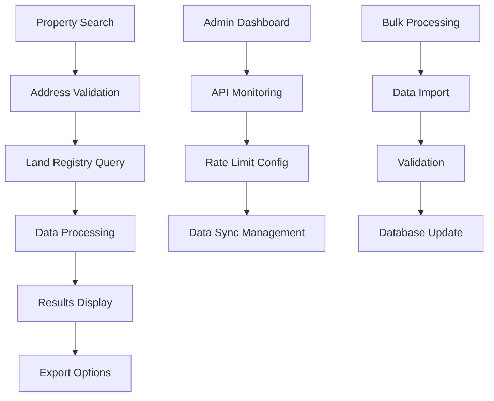

# UK Land Registry API Integration - Technical Specification

## 1. Product Overview

This document outlines the technical implementation of UK Land Registry API integration for PropertyMasters UK platform. The integration will provide access to official government property data including ownership information, price paid data, and transaction history to enhance property search and valuation capabilities.

The Land Registry integration will complement the existing Royal Mail PAF system by adding authoritative property ownership and transaction data, enabling comprehensive property intelligence for users.

## 2. Core Features

### 2.1 User Roles

| Role | Registration Method | Core Permissions |
|------|---------------------|------------------|
| Basic User | Email registration | Can view basic property information and limited price data |
| Premium User | Subscription upgrade | Can access full ownership data, detailed transaction history, and bulk searches |
| Agent User | Professional verification | Can access commercial property data and advanced analytics |
| Admin User | Internal access | Can manage API keys, monitor usage, and configure rate limits |

### 2.2 Feature Module

Our Land Registry integration consists of the following main components:

1. **Property Ownership Search**: Query property ownership details by address or title number
2. **Price Paid Data**: Access historical property transaction prices and dates
3. **Transaction History**: View complete property sale history and ownership changes
4. **Title Information**: Retrieve property title details and legal information
5. **Bulk Data Processing**: Handle large-scale property data imports and updates
6. **Data Synchronization**: Automated updates from Land Registry data feeds

### 2.3 Page Details

| Page Name | Module Name | Feature description |
|-----------|-------------|---------------------|
| Property Details | Ownership Information | Display current and historical property ownership data, title numbers, and legal status |
| Property Details | Price History | Show historical sale prices, transaction dates, and price trends with interactive charts |
| Property Search | Advanced Filters | Filter properties by ownership type, price range, transaction date, and property characteristics |
| Property Valuation | Market Analysis | Integrate Land Registry price data with valuation algorithms for accurate property estimates |
| Bulk Search | Data Export | Allow premium users to export property data in CSV/Excel format with usage tracking |
| Admin Dashboard | API Management | Monitor Land Registry API usage, rate limits, and data synchronization status |
| Admin Dashboard | Data Quality | Track data accuracy, missing records, and synchronization errors with automated alerts |

## 3. Core Process

**Basic User Flow:**
1. User searches for property using postcode or address
2. System queries Royal Mail PAF for address validation
3. Land Registry API provides ownership and price data
4. Combined results displayed with basic property information

**Premium User Flow:**
1. User performs advanced property search with multiple filters
2. System retrieves comprehensive Land Registry data including full transaction history
3. User can export data and access detailed ownership information
4. Advanced analytics and market trends provided

**Admin Flow:**
1. Admin monitors API usage and system health
2. Configures rate limiting and caching policies
3. Manages data synchronization schedules
4. Reviews and resolves data quality issues

## 4. User Interface Design

### 4.1 Design Style

- **Primary Colors**: Deep blue (#1e40af) for Land Registry official data, complementing existing green (#059669) for Royal Mail data
- **Secondary Colors**: Light blue (#dbeafe) for data highlights, amber (#f59e0b) for premium features
- **Button Style**: Rounded corners with subtle shadows, consistent with existing design system
- **Font**: Inter font family, 14px for body text, 16px for headings, 12px for data tables
- **Layout Style**: Card-based design with clear data hierarchy, tabbed interface for different data types
- **Icons**: Government building icons for official data, chart icons for price trends, document icons for legal information

### 4.2 Page Design Overview

| Page Name | Module Name | UI Elements |
|-----------|-------------|-------------|
| Property Details | Ownership Panel | Clean white cards with blue accent borders, official government badge, structured data tables with clear typography |
| Property Details | Price History Chart | Interactive line chart with hover tooltips, time range selectors, color-coded transaction types |
| Property Search | Filter Sidebar | Collapsible filter panels with checkboxes and range sliders, clear filter tags, reset functionality |
| Bulk Search | Data Table | Sortable columns, pagination controls, export buttons with progress indicators, selection checkboxes |
| Admin Dashboard | Metrics Cards | KPI cards with trend indicators, real-time status badges, alert notifications with color coding |

### 4.3 Responsiveness

Desktop-first approach with mobile-adaptive design. Touch-optimized controls for mobile users including larger tap targets for data tables and simplified navigation. Responsive data tables with