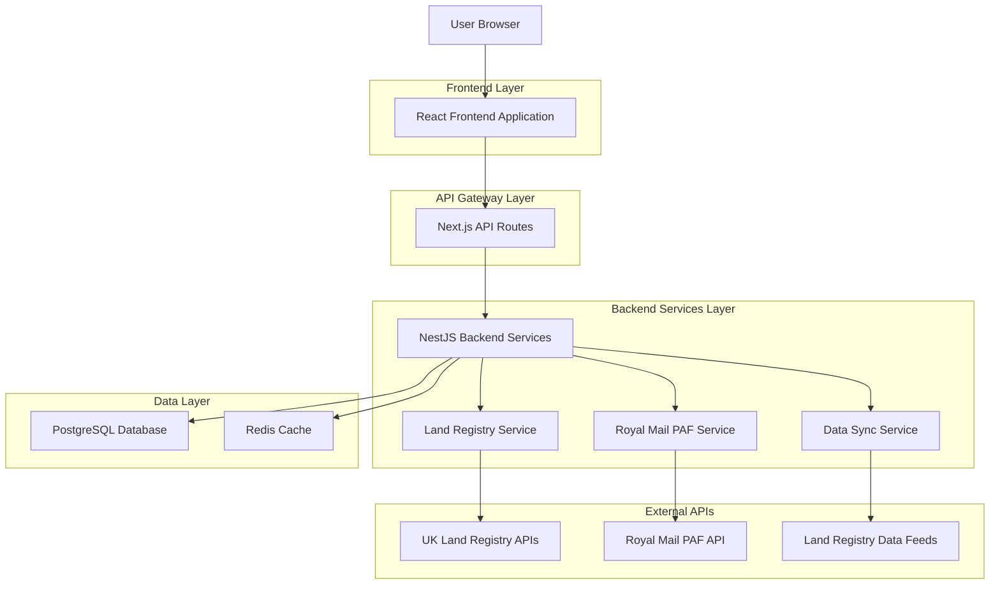
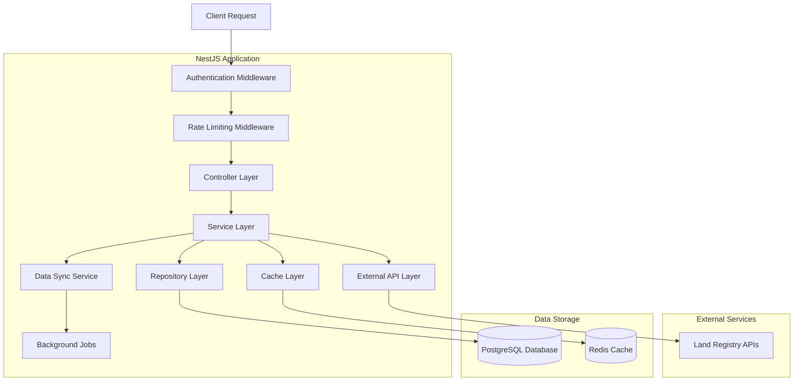
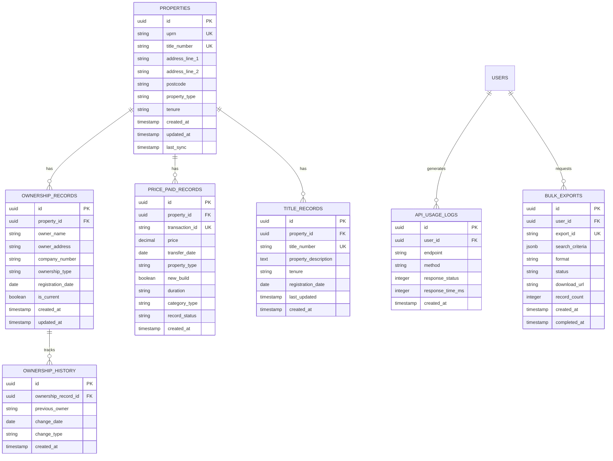

# UK Land Registry API Integration - Technical Architecture

## 1. Architecture Design



## 2. Technology Description

- Frontend: React@18 + Next.js@14 + TypeScript@5 + Tailwind CSS@3 + Lucide React
- Backend: NestJS@10 + TypeScript@5 + Express@4
- Database: PostgreSQL@15 (via Supabase)
- Cache: Redis@7
- Authentication: Supabase Auth
- File Storage: Supabase Storage
- API Documentation: Swagger/OpenAPI
- Testing: Jest + Supertest
- Monitoring: Winston Logger

## 3. Route Definitions

| Route | Purpose |
|-------|---------|
| /property/search | Enhanced property search with Land Registry data |
| /property/details/:id | Property details with ownership and price history |
| /property/ownership/:titleNumber | Property ownership information by title number |
| /property/price-history/:uprn | Historical price data for specific property |
| /property/bulk-search | Bulk property data search and export |
| /admin/land-registry | Land Registry API management dashboard |
| /admin/data-sync | Data synchronization monitoring and control |

## 4. API Definitions

### 4.1 Core API

**Property Ownership Lookup**
```
GET /api/land-registry/ownership/:titleNumber
```

Request:
| Param Name | Param Type | isRequired | Description |
|------------|------------|------------|-------------|
| titleNumber | string | true | Land Registry title number |
| includeHistory | boolean | false | Include ownership history |

Response:
| Param Name | Param Type | Description |
|------------|------------|-------------|
| titleNumber | string | Property title number |
| currentOwner | OwnershipInfo | Current property owner details |
| ownershipHistory | OwnershipInfo[] | Historical ownership records |
| propertyDescription | string | Legal property description |
| tenure | string | Freehold or Leasehold |
| lastUpdated | string | Last data update timestamp |

**Price Paid Data Search**
```
GET /api/land-registry/price-paid
```

Request:
| Param Name | Param Type | isRequired | Description |
|------------|------------|------------|-------------|
| postcode | string | false | Property postcode |
| address | string | false | Property address |
| dateFrom | string | false | Start date (YYYY-MM-DD) |
| dateTo | string | false | End date (YYYY-MM-DD) |
| minPrice | number | false | Minimum price filter |
| maxPrice | number | false | Maximum price filter |
| propertyType | string | false | D/S/T/F/O (Detached/Semi/Terraced/Flat/Other) |
| newBuild | boolean | false | New build properties only |
| limit | number | false | Results limit (default: 100, max: 1000) |
| offset | number | false | Results offset for pagination |

Response:
| Param Name | Param Type | Description |
|------------|------------|-------------|
| transactions | PricePaidRecord[] | Array of price paid records |
| totalCount | number | Total matching records |
| hasMore | boolean | More results available |

**Bulk Data Export**
```
POST /api/land-registry/bulk-export
```

Request:
| Param Name | Param Type | isRequired | Description |
|------------|------------|------------|-------------|
| searchCriteria | BulkSearchCriteria | true | Search parameters |
| format | string | true | Export format (csv/excel/json) |
| email | string | false | Email for large exports |

Response:
| Param Name | Param Type | Description |
|------------|------------|-------------|
| exportId | string | Unique export identifier |
| status | string | Export status (pending/processing/completed/failed) |
| downloadUrl | string | Download URL when completed |
| estimatedRecords | number | Estimated number of records |

### 4.2 TypeScript Interfaces

```typescript
interface OwnershipInfo {
  name: string;
  address: string;
  companyNumber?: string;
  dateOfRegistration: string;
  ownershipType: 'individual' | 'company' | 'trust' | 'other';
}

interface PricePaidRecord {
  transactionId: string;
  price: number;
  dateOfTransfer: string;
  postcode: string;
  propertyType: 'D' | 'S' | 'T' | 'F' | 'O';
  oldNew: 'Y' | 'N';
  duration: 'F' | 'L';
  paon: string;
  saon?: string;
  street: string;
  locality?: string;
  city: string;
  district: string;
  county: string;
  ppd_category_type: 'A' | 'B';
  record_status: 'A' | 'C' | 'D';
}

interface BulkSearchCriteria {
  postcodes?: string[];
  priceRange?: { min: number; max: number };
  dateRange?: { from: string; to: string };
  propertyTypes?: string[];
  newBuildOnly?: boolean;
  maxRecords?: number;
}

interface LandRegistryApiResponse<T> {
  success: boolean;
  data?: T;
  error?: {
    code: string;
    message: string;
    details?: any;
  };
  metadata?: {
    requestId: string;
    timestamp: string;
    rateLimit?: {
      remaining: number;
      resetTime: string;
    };
  };
}
```

## 5. Server Architecture Diagram



## 6. Data Model

### 6.1 Data Model Definition



### 6.2 Data Definition Language

**Properties Table**
```sql
-- Create properties table
CREATE TABLE properties (
    id UUID PRIMARY KEY DEFAULT gen_random_uuid(),
    uprn VARCHAR(20) UNIQUE,
    title_number VARCHAR(20) UNIQUE,
    address_line_1 VARCHAR(255) NOT NULL,
    address_line_2 VARCHAR(255),
    postcode VARCHAR(10) NOT NULL,
    property_type VARCHAR(1) CHECK (property_type IN ('D', 'S', 'T', 'F', 'O')),
    tenure VARCHAR(1) CHECK (tenure IN ('F', 'L')),
    created_at TIMESTAMP WITH TIME ZONE DEFAULT NOW(),
    updated_at TIMESTAMP WITH TIME ZONE DEFAULT NOW(),
    last_sync TIMESTAMP WITH TIME ZONE
);

-- Create indexes
CREATE INDEX idx_properties_postcode ON properties(postcode);
CREATE INDEX idx_properties_uprn ON properties(uprn);
CREATE INDEX idx_properties_title_number ON properties(title_number);
CREATE INDEX idx_properties_last_sync ON properties(last_sync);
```

**Ownership Records Table**
```sql
-- Create ownership_records table
CREATE TABLE ownership_records (
    id UUID PRIMARY KEY DEFAULT gen_random_uuid(),
    property_id UUID NOT NULL REFERENCES properties(id) ON DELETE CASCADE,
    owner_name VARCHAR(255) NOT NULL,
    owner_address TEXT,
    company_number VARCHAR(20),
    ownership_type VARCHAR(20) CHECK (ownership_type IN ('individual', 'company', 'trust', 'other')),
    registration_date DATE,
    is_current BOOLEAN DEFAULT true,
    created_at TIMESTAMP WITH TIME ZONE DEFAULT NOW(),
    updated_at TIMESTAMP WITH TIME ZONE DEFAULT NOW()
);

-- Create indexes
CREATE INDEX idx_ownership_records_property_id ON ownership_records(property_id);
CREATE INDEX idx_ownership_records_is_current ON ownership_records(is_current);
CREATE INDEX idx_ownership_records_owner_name ON ownership_records(owner_name);
```

**Price Paid Records Table**
```sql
-- Create price_paid_records table
CREATE TABLE price_paid_records (
    id UUID PRIMARY KEY DEFAULT gen_random_uuid(),
    property_id UUID REFERENCES properties(id) ON DELETE CASCADE,
    transaction_id VARCHAR(50) UNIQUE NOT NULL,
    price DECIMAL(12,2) NOT NULL,
    transfer_date DATE NOT NULL,
    property_type VARCHAR(1) CHECK (property_type IN ('D', 'S', 'T', 'F', 'O')),
    new_build BOOLEAN DEFAULT false,
    duration VARCHAR(1) CHECK (duration IN ('F', 'L')),
    category_type VARCHAR(1) CHECK (category_type IN ('A', 'B')),
    record_status VARCHAR(1) CHECK (record_status IN ('A', 'C', 'D')),
    created_at TIMESTAMP WITH TIME ZONE DEFAULT NOW()
);

-- Create indexes
CREATE INDEX idx_price_paid_property_id ON price_paid_records(property_id);
CREATE INDEX idx_price_paid_transfer_date ON price_paid_records(transfer_date DESC);
CREATE INDEX idx_price_paid_price ON price_paid_records(price);
CREATE INDEX idx_price_paid_transaction_id ON price_paid_records(transaction_id);
```

**API Usage Logs Table**
```sql
-- Create api_usage_logs table
CREATE TABLE api_usage_logs (
    id UUID PRIMARY KEY DEFAULT gen_random_uuid(),
    user_id UUID REFERENCES auth.users(id),
    endpoint VARCHAR(255) NOT NULL,
    method VARCHAR(10) NOT NULL,
    response_status INTEGER NOT NULL,
    response_time_ms INTEGER,
    created_at TIMESTAMP WITH TIME ZONE DEFAULT NOW()
);

-- Create indexes
CREATE INDEX idx_api_usage_logs_user_id ON api_usage_logs(user_id);
CREATE INDEX idx_api_usage_logs_created_at ON api_usage_logs(created_at DESC);
CREATE INDEX idx_api_usage_logs_endpoint ON api_usage_logs(endpoint);
```

**Row Level Security Policies**
```sql
-- Enable RLS
ALTER TABLE properties ENABLE ROW LEVEL SECURITY;
ALTER TABLE ownership_records ENABLE ROW LEVEL SECURITY;
ALTER TABLE price_paid_records ENABLE ROW LEVEL SECURITY;
ALTER TABLE api_usage_logs ENABLE ROW LEVEL SECURITY;

-- Grant permissions
GRANT SELECT ON properties TO anon;
GRANT SELECT ON price_paid_records TO anon;
GRANT ALL PRIVILEGES ON properties TO authenticated;
GRANT ALL PRIVILEGES ON ownership_records TO authenticated;
GRANT ALL PRIVILEGES ON price_paid_records TO authenticated;
GRANT ALL PRIVILEGES ON api_usage_logs TO authenticated;

-- Create policies
CREATE POLICY "Public properties are viewable by everyone" ON properties
    FOR SELECT USING (true);

CREATE POLICY "Users can view their own API logs" ON api_usage_logs
    FOR SELECT USING (auth.uid() = user_id);
```
